# R与RStudio

## 关于R与RStudio

R语言是一种统计计算和图形化编程语言，它提供了丰富的数据分析和数据可视化功能。它由新西兰奥克兰大学的Ross Ihaka和Robert Gentleman于1993年开发而成，目前由全球范围内的开发者社区维护和扩展。

R语言广泛用于数据科学、统计学、机器学习、数据挖掘和数据可视化等领域。它具有强大的统计分析能力，可以进行数据处理、统计模型拟合、假设检验、数据可视化等各种数据分析任务。

R语言是一种开源软件。开源指的是软件源代码对公众开放并可自由访问、使用、修改和分发。开源软件的许可证允许用户查看、修改和共享软件的源代码，以满足不同的需求和目标。

开源软件的好处包括：

1. 自由和灵活：开源软件赋予用户使用、修改和分发软件的自由，可以根据自己的需求进行定制和扩展。
2. 可靠性和安全性：开源软件经过广泛的审查和测试，可以由全球的开发者社区共同参与改进和修复漏洞，提高软件的质量和安全性。
3. 社区支持：开源软件通常拥有活跃的用户和开发者社区，提供技术支持、文档、教程和交流平台，用户可以相互学习和分享经验。
4. 创新和合作：开源软件鼓励合作和共享，可以促进创新和技术进步，避免了重复开发相同功能的软件。

R语言作为开源软件，不仅有一个庞大的开发者社区为其开发和维护各种功能和扩展包，还有丰富的文档和资源可供学习和使用。这使得R语言成为了数据科学和统计分析领域的主要工具之一，并得到了广泛的应用和推广。

RStudio并不是一个软件，而是一个代码编辑器，R软件本身是自带一个编译软件的，但是不美观，所以基于了这个软件开发了一个更加美观的界面。

必须先安装R然后再安装RStudio，另外安装目录当中不要有中文。

## 如何安装

要安装R语言，可以按照以下步骤进行：

1. 访问R语言官方网站（https://www.r-project.org/）。
2. 在官方网站上找到并点击"CRAN"（Comprehensive R Archive Network）链接。
3. 选择适合您操作系统的下载链接（Windows、Mac或Linux）。
4. 下载对应操作系统的安装程序，并运行安装程序。
5. 在安装过程中，按照提示进行选择和设置。通常来说，您可以使用默认选项完成安装。
6. 完成安装后，您可以在计算机上找到R语言的启动图标或者在命令行中输入"R"来启动R语言的交互式环境。

安装R语言后，您还可以使用RStudio等集成开发环境（IDE）来更方便地编写和运行R代码。RStudio提供了丰富的功能和用户友好的界面，可以进一步提升您的R语言编程体验。您可以访问RStudio官方网站（https://www.rstudio.com/）并下载适合您操作系统的RStudio版本进行安装。

## R与RStudio的基础操作

RStudio的界面如下所示：

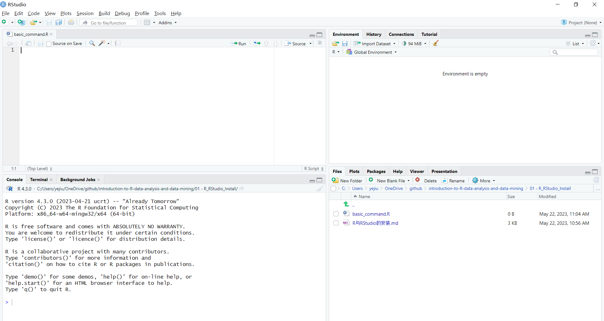

在左下方进行一些简单的操作：

```R
> 1 + 2
[1] 3
> 1 - 2
[1] -1
> 1 / 2
[1] 0.5
> 1 * 2
[1] 2
> 3 %% 2
[1] 1
> 10 %/% 3
[1] 3
```

Console这个窗口更多的是用来查看数据操作结果的，而编写程序则在file页面，一个操作如下所示：

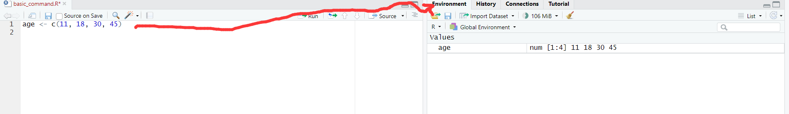

可以用来生成一个变量，并且进行赋值，赋值需要采用 <- 而不是 =，赋值之后变量可以在右侧Environment窗口中查看。

接着我们添加另一个变量BMI，接着查看相关性：

```R
> age <- c(11, 18, 30, 45)
> BMI <- c(18.4, 21.2, 28.6, 22.7)
> cor.test(age, BMI)

	Pearson's product-moment correlation

data:  age and BMI
t = 0.86193, df = 2, p-value = 0.4796
alternative hypothesis: true correlation is not equal to 0
95 percent confidence interval:
 -0.8816281  0.9875606
sample estimates:
      cor 
0.5204329 
```

R语言会自动的将两者的相关性计算出来，并且给出结果，注意，这两个变量都是随便编造的，并不代表现实中真的有这样的关联。

`corr.test()`和`corr()`都是R语言中用于计算相关性的函数，但它们之间有一些区别。

1. `corr.test()`：
   
   - `corr.test()`函数用于执行相关性假设检验，可以计算相关系数的显著性水平（p-value）和置信区间等统计信息。
   - 它可以计算多个变量之间的相关性，返回一个相关性矩阵，并提供相关性系数的显著性检验结果。
   - 该函数可以使用不同的相关性系数，如Pearson相关系数、Spearman相关系数和Kendall相关系数等。
   - 示例代码：
     ```R
     x <- c(1, 2, 3, 4, 5)
     y <- c(2, 4, 6, 8, 10)
     result <- corr.test(x, y)
     print(result)
     ```
     输出：
     ```
     Pearson's product-moment correlation
     
     data:  x and y
     t = Inf, df = 3, p-value = 0.002778
     alternative hypothesis: true correlation is not equal to 0
     95 percent confidence interval:
      0.9707259 1.0000000
     sample estimates:
           cor 
     0.9933993
     ```
     在上述示例中，我们使用`corr.test()`函数计算了变量x和y之间的Pearson相关系数，并提供了显著性检验结果、置信区间和样本估计值。
   
2. `corr()`：
   - `corr()`函数用于计算相关性矩阵，可以计算多个变量之间的相关性，并返回相关系数矩阵。
   - 它可以使用不同的相关性系数，如Pearson相关系数、Spearman相关系数和Kendall相关系数等。
   - 不像`corr.test()`函数，`corr()`函数不提供相关性的显著性检验结果和置信区间。
   - 示例代码：
     ```R
     x <- c(1, 2, 3, 4, 5)
     y <- c(2, 4, 6, 8, 10)
     result <- corr(x, y, method = "pearson")
     print(result)
     ```
     输出：
     ```
           [,1]
     [1,]    1
     ```
     在上述示例中，我们使用`corr()`函数计算了变量x和y之间的Pearson相关系数，并返回了相关系数矩阵。

综上所述，`corr.test()`用于执行相关性的假设检验，提供相关系数的显著性检验结果和置信区间等统计信息。而`corr()`用于计算相关性矩阵，返回相关系数的矩阵。根据您的需求，选择适当的函数来计算和解释相关性。

还可以绘制一下age和BMI的散点图：

```R
plot(age, BMI)
```

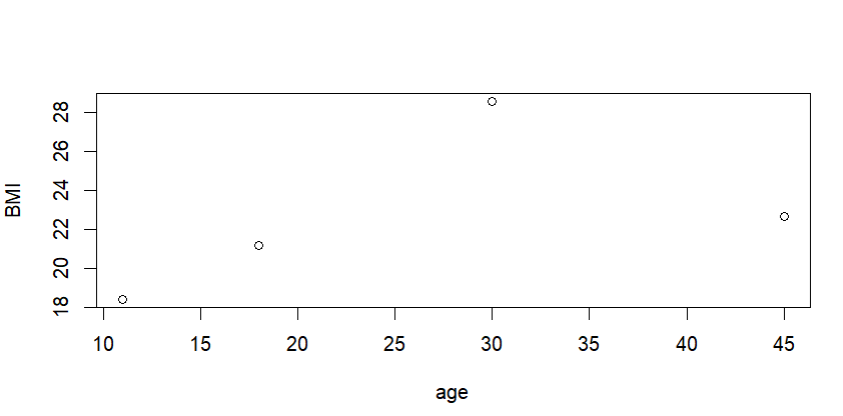

# R语言程序包

## 安装

R程序包（R package）是一种用于扩展R语言功能的软件模块。它是一组预定义的R函数、数据和文档的集合，被组织成一个单独的单元，以便用户能够方便地安装、加载和使用其中的功能。

R程序包通常由R语言社区的开发者创建和维护，以满足不同领域和任务的需求。它们可以提供各种功能，包括数据处理、统计分析、机器学习、可视化等。

R程序包通常包含以下组成部分：

1. R函数：包含一组用R语言编写的函数，用于实现特定的功能。这些函数可以被用户调用和使用。
2. 数据：包含一些示例数据集或用于演示目的的数据文件。这些数据可以帮助用户理解和运行程序包中的功能。
3. 文档：包含关于程序包的详细说明、使用方法、函数说明和示例代码等文档。这些文档可以帮助用户了解和使用程序包的功能。
4. 依赖关系：程序包可以依赖于其他程序包或软件库，这些依赖关系通常在程序包的描述文件中声明。这确保了使用程序包时所需的依赖项能够正确安装和加载。

通过使用R程序包，用户可以轻松地扩展R语言的功能，并利用其他开发者共享的功能和工具。用户可以通过在线存储库（如CRAN、Bioconductor和GitHub等）或本地文件安装程序包，并使用`library()`函数将其加载到R会话中。一旦加载，用户可以使用程序包中提供的函数和工具来完成特定的任务和分析。

R程序包的开放性和共享性使得R语言生态系统变得丰富和多样，用户可以根据自己的需求选择和使用各种程序包来扩展和定制他们的分析和研究工作。

R语言自带了一些核心程序包，这些程序包在安装R时会一同安装。以下是一些常见的R语言自带程序包的示例：

1. `stats`：提供了统计分析和相关函数，包括基本的统计描述、概率分布、假设检验、回归分析等。

2. `graphics`：用于绘图和可视化的程序包，包括散点图、线图、柱状图、箱线图等。

3. `datasets`：包含一些内置的示例数据集，用于学习和练习R语言的数据分析。

4. `grDevices`：提供与图形设备（如屏幕、打印机）交互的函数，用于图形输出和设备控制。

5. `utils`：包含一些实用函数，用于常见的操作，如文件处理、帮助文档查找、包管理等。

6. `base`：包含R语言的基本函数和数据类型，是其他核心程序包的基础。

除了这些核心程序包，R语言还有许多其他功能强大的程序包，它们不是默认安装的，但可以通过安装命令从CRAN（Comprehensive R Archive Network）等在线存储库中获取。这些额外的程序包覆盖了各种领域和任务，包括数据处理、机器学习、可视化、生物信息学等。

要查看当前已加载的程序包列表，可以使用`library()`函数或`sessionInfo()`函数。例如，`library()`函数可以列出已加载的程序包：

```R
library()
```

通过安装和加载不同的程序包，用户可以根据自己的需求扩展R语言的功能，并利用其他开发者共享的工具和方法来进行数据分析和编程。

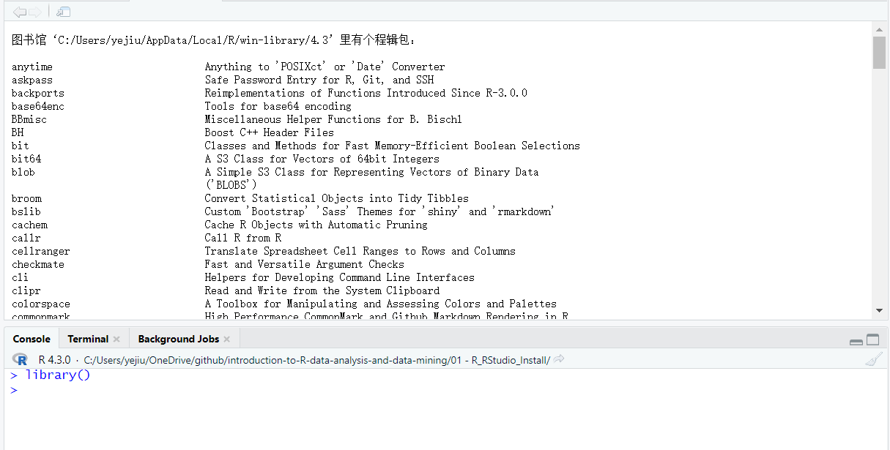

有哪些包和是否载入可以查看右下方的界面：

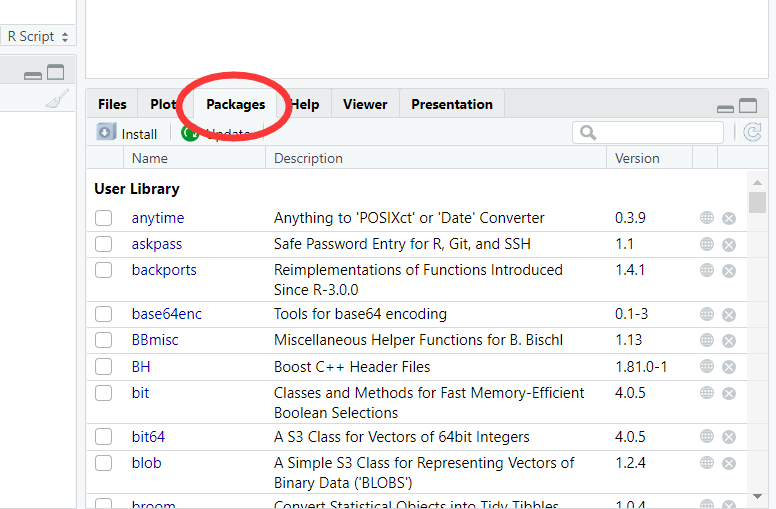

往下拉可以看到System Library：

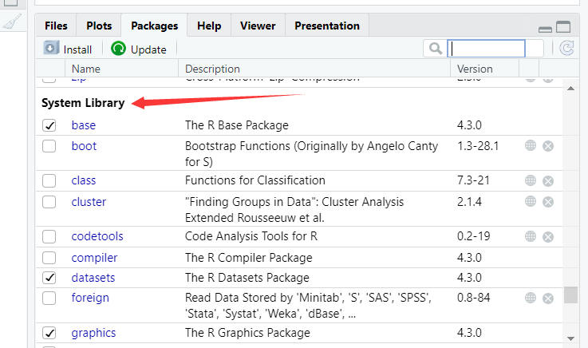

如果要安装新的library，则可以使用tool的Install Packages：

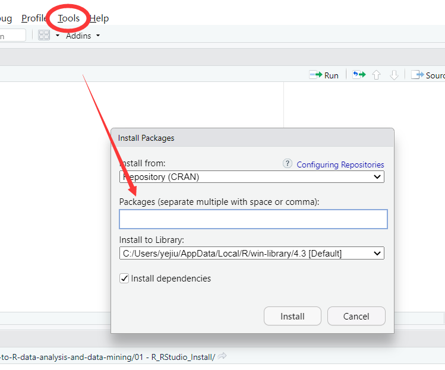

这里安装pROC，可以看到这样的一段代码：

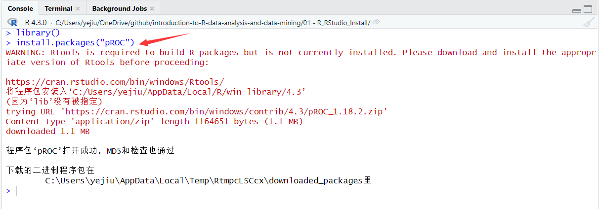

直接输入这一段代码其实也能够达到同样的效果。

接着就可以找到对应的package：

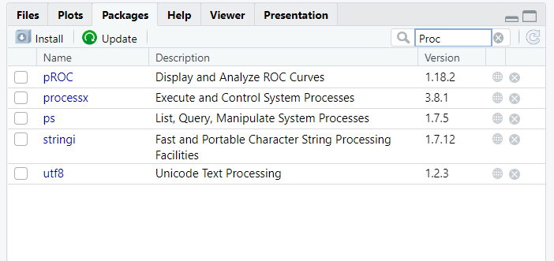

尝试使用代码来进行安装：

```R
> install.packages("rms")  # 安装rms包
WARNING: Rtools is required to build R packages but is not currently installed. Please download and install the appropriate version of Rtools before proceeding:

https://cran.rstudio.com/bin/windows/Rtools/
将程序包安装入‘C:/Users/yejiu/AppData/Local/R/win-library/4.3’
(因为‘lib’没有被指定)
还安装相依关系‘zoo’, ‘viridis’, ‘Formula’, ‘MatrixModels’, ‘mvtnorm’, ‘TH.data’, ‘sandwich’, ‘Hmisc’, ‘quantreg’, ‘SparseM’, ‘polspline’, ‘multcomp’, ‘htmlTable’

trying URL 'https://cran.rstudio.com/bin/windows/contrib/4.3/zoo_1.8-12.zip'
Content type 'application/zip' length 1019243 bytes (995 KB)
downloaded 995 KB

trying URL 'https://cran.rstudio.com/bin/windows/contrib/4.3/viridis_0.6.3.zip'
Content type 'application/zip' length 3017295 bytes (2.9 MB)
downloaded 2.9 MB

trying URL 'https://cran.rstudio.com/bin/windows/contrib/4.3/Formula_1.2-5.zip'
Content type 'application/zip' length 160630 bytes (156 KB)
downloaded 156 KB

trying URL 'https://cran.rstudio.com/bin/windows/contrib/4.3/MatrixModels_0.5-1.zip'
Content type 'application/zip' length 442907 bytes (432 KB)
downloaded 432 KB

trying URL 'https://cran.rstudio.com/bin/windows/contrib/4.3/mvtnorm_1.1-3.zip'
Content type 'application/zip' length 233937 bytes (228 KB)
downloaded 228 KB

trying URL 'https://cran.rstudio.com/bin/windows/contrib/4.3/TH.data_1.1-2.zip'
Content type 'application/zip' length 8825649 bytes (8.4 MB)
downloaded 8.4 MB

trying URL 'https://cran.rstudio.com/bin/windows/contrib/4.3/sandwich_3.0-2.zip'
Content type 'application/zip' length 1453110 bytes (1.4 MB)
downloaded 1.4 MB

trying URL 'https://cran.rstudio.com/bin/windows/contrib/4.3/Hmisc_5.1-0.zip'
Content type 'application/zip' length 3498501 bytes (3.3 MB)
downloaded 3.3 MB

trying URL 'https://cran.rstudio.com/bin/windows/contrib/4.3/quantreg_5.95.zip'
Content type 'application/zip' length 1729257 bytes (1.6 MB)
downloaded 1.6 MB

trying URL 'https://cran.rstudio.com/bin/windows/contrib/4.3/SparseM_1.81.zip'
Content type 'application/zip' length 1043495 bytes (1019 KB)
downloaded 1019 KB

trying URL 'https://cran.rstudio.com/bin/windows/contrib/4.3/polspline_1.1.22.zip'
Content type 'application/zip' length 600557 bytes (586 KB)
downloaded 586 KB

trying URL 'https://cran.rstudio.com/bin/windows/contrib/4.3/multcomp_1.4-23.zip'
Content type 'application/zip' length 744069 bytes (726 KB)
downloaded 726 KB

trying URL 'https://cran.rstudio.com/bin/windows/contrib/4.3/htmlTable_2.4.1.zip'
Content type 'application/zip' length 426675 bytes (416 KB)
downloaded 416 KB

trying URL 'https://cran.rstudio.com/bin/windows/contrib/4.3/rms_6.7-0.zip'
Content type 'application/zip' length 2236987 bytes (2.1 MB)
downloaded 2.1 MB

程序包‘zoo’打开成功，MD5和检查也通过
程序包‘viridis’打开成功，MD5和检查也通过
程序包‘Formula’打开成功，MD5和检查也通过
程序包‘MatrixModels’打开成功，MD5和检查也通过
程序包‘mvtnorm’打开成功，MD5和检查也通过
程序包‘TH.data’打开成功，MD5和检查也通过
程序包‘sandwich’打开成功，MD5和检查也通过
程序包‘Hmisc’打开成功，MD5和检查也通过
程序包‘quantreg’打开成功，MD5和检查也通过
程序包‘SparseM’打开成功，MD5和检查也通过
程序包‘polspline’打开成功，MD5和检查也通过
程序包‘multcomp’打开成功，MD5和检查也通过
程序包‘htmlTable’打开成功，MD5和检查也通过
程序包‘rms’打开成功，MD5和检查也通过

下载的二进制程序包在
	C:\Users\yejiu\AppData\Local\Temp\RtmpcLSCcx\downloaded_packages里
```

成功安装。

接着就是载入rms：

```R
> library(rms)
载入需要的程辑包：Hmisc

载入程辑包：‘Hmisc’

The following objects are masked from ‘package:base’:

    format.pval, units

```

在R语言中，`detach()`函数用于从当前会话中卸载（detach）已加载的程序包。它的作用是将程序包从搜索路径中移除，使得其中定义的函数和对象不再可直接访问。

`detach()`函数的语法如下：

```
RCopy code
detach(package, unload = FALSE, character.only = FALSE)
```

参数说明：

- `package`：要卸载的程序包的名称或位置。
- `unload`：指定是否卸载程序包。默认为`FALSE`，表示仅将程序包从搜索路径中移除，但不卸载它。设置为`TRUE`时，会同时卸载程序包。
- `character.only`：指定`package`参数是否只接受字符型输入。默认为`FALSE`，表示`package`参数可以接受字符型或位置型输入。

示例用法：

```
RCopy code
detach(package: dplyr)
```

上述示例中，`detach()`函数将已加载的`dplyr`程序包从搜索路径中移除，不进行卸载。

需要注意的是，使用`detach()`函数仅仅将程序包从搜索路径中移除，并不会删除已加载的函数和对象。如果需要完全卸载程序包，包括清除已加载的函数和对象，可以将`unload`参数设置为`TRUE`。

在某些情况下，当加载多个程序包或出现命名冲突时，可能需要使用`detach()`函数来管理已加载的程序包，以避免命名空间冲突和函数名冲突等问题。

如果点击退出：

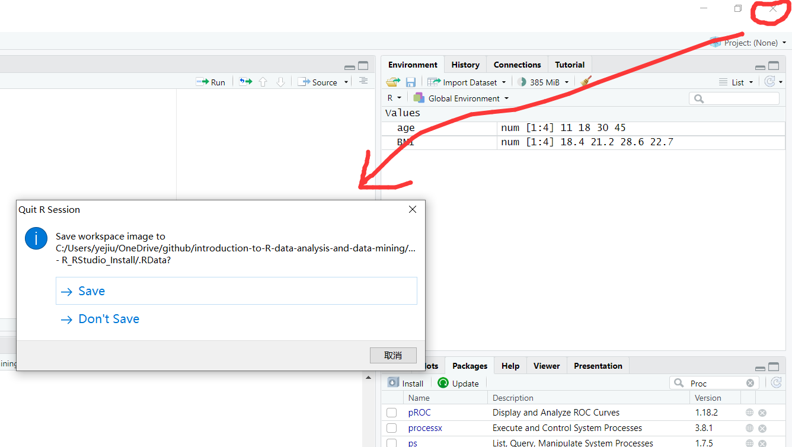

如果R会话包含了一些已加载的数据、变量或对象，R会提示您是否保存工作空间图像。

`Save workspace image? [y/n/c]`是R会话在退出时的默认提示信息，它询问您是否要保存当前会话的工作空间图像。

- 如果选择`y`，表示您希望保存当前会话的工作空间图像。这将生成一个`.RData`文件，其中包含了当前会话中的所有数据、变量和对象。以后可以使用`load()`函数加载该文件以恢复会话的状态。
- 如果选择`n`，表示您不希望保存当前会话的工作空间图像，会话结束后会丢失会话期间的数据、变量和对象。
- 如果选择`c`，表示取消保存，并且会话结束后会保留会话期间的数据、变量和对象。

应该根据您的需求来选择适当的选项：

- 如果您希望保存当前会话的状态，以便以后重新加载并继续使用会话中的数据和对象，选择`y`。
- 如果您不需要保存当前会话的状态，并且希望在下次启动R时开始一个新的空白会话，选择`n`。
- 如果您犹豫不决或不确定是否要保存当前会话的状态，可以选择`c`以取消保存。

选择是否保存工作空间图像取决于您对会话数据的重要性和下次启动R时的需求。如果您经常在同一个项目上工作，并希望每次启动R时都恢复到上次的状态，保存工作空间图像可能是一个好的选择。但是，如果您经常切换项目或希望始终从一个干净的状态开始，不保存工作空间图像可能更合适。

请注意，使用工作空间图像的保存和加载可能会在不同的R会话之间引入潜在的问题，如命名空间冲突和对象覆盖。在决定是否保存工作空间图像时，请谨慎考虑这些因素。

选择是，再次打开，可以发现：

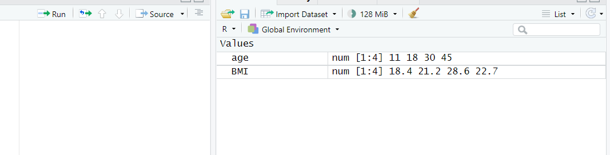

## 查询

想要知道怎么使用某一个包，可以使用?来进行查询：

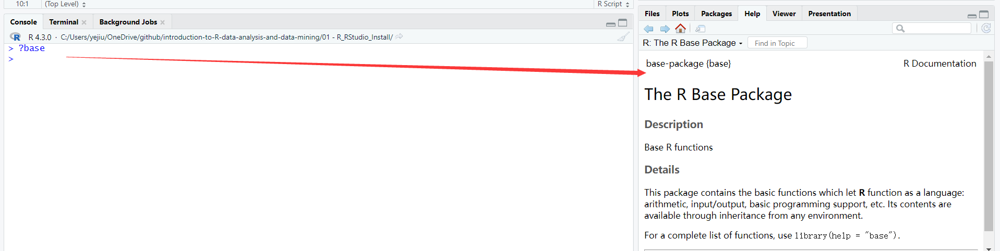