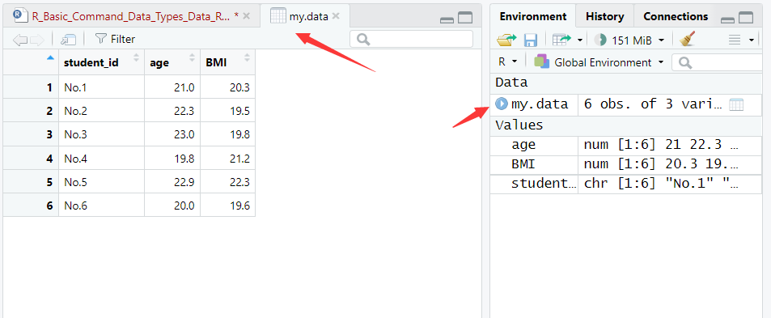
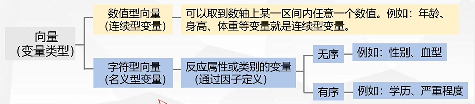
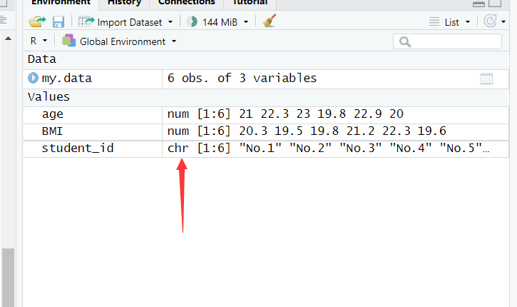
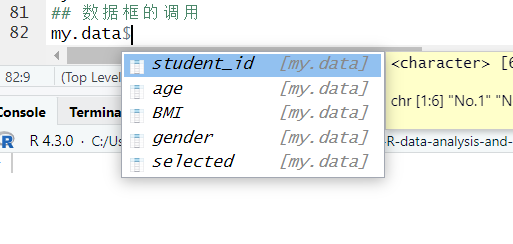

# R语言的基础运算

## 赋值与datafram

首先是进行赋值和构建dataframe：

```R
> ## 首先是使用 <- 来进行赋值
> age <- c(21, 22.3, 23, 19.8, 22.9, 20)
> BMI <- c(20.3, 19.5, 19.8, 21.2, 22.3, 19.6)
> student_id <- c("No.1", "No.2", "No.3", "No.4", "No.5", "No.6")
> # 组成一个datafram
> data.frame(student_id, age, BMI)
  student_id  age  BMI
1       No.1 21.0 20.3
2       No.2 22.3 19.5
3       No.3 23.0 19.8
4       No.4 19.8 21.2
5       No.5 22.9 22.3
6       No.6 20.0 19.6
> my.data <- data.frame(student_id, age, BMI)
```

点击my.data可以得到：



R语言的命名规则如下：

1. 变量命名：变量名可以由字母、数字和句点（.）组成，但必须以字母或句点开头。R是区分大小写的，所以变量名中的大小写也要一致。推荐使用有意义的名称来描述变量的用途。

2. 函数命名：函数名遵循与变量相同的规则，建议使用动词开头，描述函数的操作。

3. 包命名：包名同样遵循变量命名规则，推荐使用有意义且简洁的名称。

4. 常量命名：常量通常使用全大写字母，可以使用下划线分隔单词，以增加可读性。例如：MAX_ITERATIONS。

5. 文件命名：文件名也应遵循变量命名规则，推荐使用小写字母，使用下划线分隔单词。例如：data_analysis.R。

总的来说，R语言的命名规则注重可读性和描述性，以便于他人理解和维护代码。

## 基本运算

R语言可以进行最基本的四则运算：

```R
> ## 四则运算
> 2 + 3
[1] 5
> 2 - 3
[1] -1
> 4 * 6
[1] 24
> 7 / 9
[1] 0.7777778
```

R语言的其他运算：

```R
> ## 其他运算
> 3 %% 2  # 整除求余
[1] 1
> 3 ^ 2  # 乘方运算
[1] 9
> 5 %/% 2  # 整除求商
[1] 2
```

R语言进1和去除小数：

```R
> ## 处理小数部分
> ceiling(6.4)
[1] 7
> floor(6.4)
[1] 6
```

乘方的两种做法：

```R
> 5 ^ 2
[1] 25
> 5 ** 2
[1] 25
```

求平方根：

```R
> ## 平方根
> sqrt(25)
[1] 5
```

三角函数：

```R
> ## 三角函数
> sin(pi/ 180 * 30)
[1] 0.5
> cos(pi/ 180 * 30)
[1] 0.8660254
> tan(pi/ 180 * 30)
[1] 0.5773503
```

对数函数：

```R
> ## 对数函数，log(x, base = 10)
> log(100, base = 10)  # 10的几次方是100
[1] 2
> log(64, base = 8)  # 8的几次方是64
[1] 2
> log(128, base = 2)  # 2的几次方是128
[1] 7
```

如果不提供base，则默认为自然数e：

```R
> exp(1)
[1] 2.718282
> log(exp(1))
[1] 1
```

## 简单的统计运算

简单的统计运算：

```R
> ## 简单的统计运算
> my.data
  student_id  age  BMI
1       No.1 21.0 20.3
2       No.2 22.3 19.5
3       No.3 23.0 19.8
4       No.4 19.8 21.2
5       No.5 22.9 22.3
6       No.6 20.0 19.6
> mean(my.data$age)  # 求取age这个变量的平均值
[1] 21.5
> sd(my.data$age)  # 求取age这个变量的standard deviation
[1] 1.431084
> var(my.data$age)  # 求取age这个变量的方差
[1] 2.048
> range(my.data$age)  # 求取age这个变量的范围
[1] 19.8 23.0
> median(my.data$age)  # 求取age这个变量的中位数median
[1] 21.65
> quantile(my.data$age)  # 求取age这个变量的四分位情况
   0%   25%   50%   75%  100% 
19.80 20.25 21.65 22.75 23.00 
> max(my.data$age)  # age的最大值
[1] 23
> min(my.data$age)  # age的最小值
[1] 19.8
```

## 四舍五入与绝对值

```R
> ## 绝对值与四舍五入
> abs(-10)
[1] 10
> abs(5)
[1] 5
> pi
[1] 3.141593
> round(pi, 2)
[1] 3.14
```

## 且，或，非

```R
> ## 且，或，非
> TRUE & FALSE
[1] FALSE
> TRUE | FALSE
[1] TRUE
> !TRUE
[1] FALSE
```

# R语言的数据类型

R最常处理的数据结构是：向量，数据框，矩阵和列表。

## 向量

在R语言中，向量（Vector）是一种基本的数据结构，用于存储一维的数据序列。向量中的元素必须是相同的数据类型，可以是数值、字符、逻辑等。R语言中的许多操作都是基于向量进行的。向量可以通过使用`c()`函数来创建，该函数将多个元素组合成一个向量。



先前已经生成的向量如下所示：



除了数字向量和字符向量之外，还有逻辑向量。

```R
> ## 逻辑向量
> logical_vecctor <- c(TRUE, FALSE, TRUE, FALSE)
> logical_vecctor
[1]  TRUE FALSE  TRUE FALSE
> # 或者可以这样
> ifelse(BMI > 20, TRUE, FALSE)  # 如果大于则为TRUE，反之则为FALSE
[1]  TRUE FALSE FALSE  TRUE  TRUE FALSE
```

这里可以将结果复制到selected变量中，这样下次可以直接将符合为TRUE的元素选择出来。

## 数据框

在R语言中，数据框（Data Frame）是一种类似于表格的二维数据结构，由不同类型的列组成，每列可以是不同的数据类型。数据框是处理和分析数据的常用数据结构，类似于关系型数据库中的表格。

数据框可以包含多个观测值（行）和多个变量（列）。每列代表一个变量，而每行代表一个观测值。变量可以是不同的数据类型，如数值、字符、逻辑等。数据框提供了一种方便的方式来组织和处理具有结构化数据的信息。

数据框可以通过使用`data.frame()`函数创建，该函数将多个向量作为列组合成一个数据框。

```R
> ## 数据框
> gender <- c("female", "male", "female", "female", "male", "male")
> selected <- ifelse(BMI > 20, TRUE, FALSE)
> my.data <- data.frame(my.data, gender, selected)
> my.data
  student_id  age  BMI gender selected
1       No.1 21.0 20.3 female     TRUE
2       No.2 22.3 19.5   male    FALSE
3       No.3 23.0 19.8 female    FALSE
4       No.4 19.8 21.2 female     TRUE
5       No.5 22.9 22.3   male     TRUE
6       No.6 20.0 19.6   male    FALSE
```

如何进行调用：

```R
> my.data[4, 5]  # 数据框中第4行第5列
[1] TRUE
> my.data[4, ]  # 数据框第4行所有数据
  student_id  age  BMI gender selected
4       No.4 19.8 21.2 female     TRUE
> my.data[, 5]  # 数据框第5列所有数据
[1]  TRUE FALSE FALSE  TRUE  TRUE FALSE
> my.data[, "age"]  # 数据框的age这一列的所有数据
[1] 21.0 22.3 23.0 19.8 22.9 20.0
> my.data$age  # 或者也可以这么做
[1] 21.0 22.3 23.0 19.8 22.9 20.0
> my.data[1, ]  # 这是第一行
  student_id age  BMI gender selected
1       No.1  21 20.3 female     TRUE
> my.data[-1, ]  # 这是不包括第一行
  student_id  age  BMI gender selected
2       No.2 22.3 19.5   male    FALSE
3       No.3 23.0 19.8 female    FALSE
4       No.4 19.8 21.2 female     TRUE
5       No.5 22.9 22.3   male     TRUE
6       No.6 20.0 19.6   male    FALSE
> my.data[c(-1, -3), ]  # 这是不包括第一行和第三行
  student_id  age  BMI gender selected
2       No.2 22.3 19.5   male    FALSE
4       No.4 19.8 21.2 female     TRUE
5       No.5 22.9 22.3   male     TRUE
6       No.6 20.0 19.6   male    FALSE
> my.data[c(1, 3, 5), ]  # 这是只包括第一行，第三行和第五行
  student_id  age  BMI gender selected
1       No.1 21.0 20.3 female     TRUE
3       No.3 23.0 19.8 female    FALSE
5       No.5 22.9 22.3   male     TRUE
```

使用$：



生成数据框：

```R
> ## 生成数据框
> matrix(1:30, nrow = 5, ncol = 6)
     [,1] [,2] [,3] [,4] [,5] [,6]
[1,]    1    6   11   16   21   26
[2,]    2    7   12   17   22   27
[3,]    3    8   13   18   23   28
[4,]    4    9   14   19   24   29
[5,]    5   10   15   20   25   30
```

数据框（Data Frame）和向量（Vector）是R语言中的两种不同的数据结构，它们有以下区别：

1. 维度：向量是一维的数据结构，由一系列相同类型的元素组成。数据框是二维的数据结构，由多个列组成，每列可以是不同的数据类型，代表不同的变量。

2. 多样性：向量中的元素必须是相同的数据类型，例如数值、字符、逻辑等。数据框中的列可以是不同的数据类型，每个列可以具有不同的数据类型。

3. 结构：向量是一个简单的数据结构，不带有任何列名或行名。数据框具有结构化的组织，每个列都有一个列名，每行都可以有一个行名。

4. 存储方式：向量在内存中是连续存储的，元素之间没有额外的结构信息。数据框在内存中以列为单位存储，每列可以有不同的数据类型和长度。

5. 用途：向量通常用于存储一维的数据序列，进行向量化的操作和计算。数据框常用于处理和分析结构化的多变量数据，类似于关系型数据库中的表格。

6. 操作：向量可以通过索引进行访问和修改，也可以进行向量化的操作。数据框可以选择特定的行或列，筛选和操作数据框中的数据，进行数据的合并和重塑等复杂操作。

总的来说，向量是一维的简单数据结构，用于存储相同类型的数据，而数据框是二维的结构化数据结构，用于存储不同类型的变量和处理多变量数据。数据框提供了更丰富的功能和灵活性，适用于更复杂的数据分析任务。

## 列表

在R语言中，列表（List）是一种复杂的数据结构，用于存储不同类型的对象（元素）的集合。列表可以包含向量、数据框、矩阵、其他列表等多种数据类型的对象，并且每个对象可以具有不同的长度和结构。

```R
> # 列
> list_01 <- list(my.data, gender, selected)
> list_01
[[1]]
  student_id  age  BMI gender selected
1       No.1 21.0 20.3 female     TRUE
2       No.2 22.3 19.5   male    FALSE
3       No.3 23.0 19.8 female    FALSE
4       No.4 19.8 21.2 female     TRUE
5       No.5 22.9 22.3   male     TRUE
6       No.6 20.0 19.6   male    FALSE

[[2]]
[1] "female" "male"   "female" "female" "male"  
[6] "male"  

[[3]]
[1]  TRUE FALSE FALSE  TRUE  TRUE FALSE

> list_01[1]
[[1]]
  student_id  age  BMI gender selected
1       No.1 21.0 20.3 female     TRUE
2       No.2 22.3 19.5   male    FALSE
3       No.3 23.0 19.8 female    FALSE
4       No.4 19.8 21.2 female     TRUE
5       No.5 22.9 22.3   male     TRUE
6       No.6 20.0 19.6   male    FALSE

> list_01[[1]]
  student_id  age  BMI gender selected
1       No.1 21.0 20.3 female     TRUE
2       No.2 22.3 19.5   male    FALSE
3       No.3 23.0 19.8 female    FALSE
4       No.4 19.8 21.2 female     TRUE
5       No.5 22.9 22.3   male     TRUE
6       No.6 20.0 19.6   male    FALSE
> list_01[[1]][, 1]
[1] "No.1" "No.2" "No.3" "No.4" "No.5" "No.6"
```

在R语言中，使用方括号`[ ]`和双方括号`[[ ]]`可以用来访问列表（List）中的元素，但它们有一些区别。

1. `[ ]`运算符：方括号用于提取列表中的子集，并返回一个新的列表。当使用方括号时，返回的是一个子列表。

```R
my_list <- list("a", "b", "c")
subset_list <- my_list[1]
```

在上面的示例中，`my_list[1]`返回一个新的列表，其中包含列表`my_list`的第一个元素。该结果是一个子列表，仍然是一个列表对象。

2. `[[ ]]`运算符：双方括号用于提取列表中的单个元素，并返回元素本身，而不是返回一个新的列表。当使用双方括号时，返回的是元素的值。

```R
my_list <- list("a", "b", "c")
element <- my_list[[1]]
```

在上面的示例中，`my_list[[1]]`返回列表`my_list`的第一个元素的值，即字符对象`"a"`。结果是元素的值，而不是一个列表对象。

总结起来，使用方括号`[ ]`可以提取列表的子集并返回一个子列表，而双方括号`[[ ]]`可以提取列表的单个元素并返回元素的值。根据需要，可以根据具体情况选择使用适当的运算符。

## 总结与比较

下面是一个比较R语言中向量、数据框和列表的简单表格：

|          | 向量                     | 数据框                   | 列表                        |
| -------- | ------------------------ | ------------------------ | --------------------------- |
| 定义     | 一维数据序列             | 二维表格，多个变量的集合 | 多个不同类型对象的集合      |
| 数据类型 | 可以是数值、字符、逻辑等 | 每列可以是不同数据类型   | 可以包含任意类型的对象      |
| 维度     | 一维                     | 二维                     | 可以是多层嵌套的结构        |
| 结构化   | 不具备结构化特征         | 有列名和行名的结构化表格 | 可以嵌套、无固定结构        |
| 存储方式 | 连续存储                 | 列为单位存储             | 指针和引用的方式            |
| 访问方式 | 通过索引访问元素         | 通过列名或索引访问元素   | 通过双方括号或$符号访问元素 |
| 操作方式 | 向量化操作               | 筛选、合并、操作列数据   | 添加、删除、嵌套元素        |
| 应用领域 | 简单的数值计算和操作     | 数据分析、统计、机器学习 | 复杂数据结构和对象管理      |

需要注意的是，这只是一个简单的比较表格，向量、数据框和列表在实际应用中有各自的特点和用途。根据具体的数据处理和分析需求，可以选择适当的数据结构来组织和操作数据。

# R软件的工作空间的读取与保存

## R软件的工作空间

R软件的工作空间（Workspace）是指在R会话期间创建和使用的变量、函数和其他对象的集合。它是在R会话中存储和管理数据和计算结果的地方。

当你启动R软件时，会话开始时创建一个新的工作空间。在工作空间中，你可以加载数据、定义变量、运行函数、进行计算和分析，并在会话期间使用和修改这些对象。

工作空间的主要作用是：

1. 存储对象：工作空间可以存储你在R会话中创建的各种对象，包括向量、数据框、列表、函数等。这些对象可以在会话期间被重复使用和修改。
2. 方便的访问：在工作空间中，你可以直接访问和操作已经创建的对象，而不需要重新加载或重新计算。这样可以提高效率并方便数据分析和交互式探索。
3. 保存和加载：你可以将工作空间保存为R数据文件（.RData或.Rda文件），以便在下一次会话中恢复工作空间的状态。这样可以方便地将工作进度和计算结果保存下来，并在后续会话中快速加载。

在R中，你可以使用`ls()`函数列出当前工作空间中的对象，使用`get()`函数获取对象的值，使用`assign()`函数将值分配给对象，使用`rm()`函数删除对象等。

可以使用以下命令保存和加载工作空间：

- 保存工作空间：`save.image()` 或 `save()` 函数将当前工作空间保存为.RData文件。
- 加载工作空间：`load()` 函数加载.RData文件，恢复工作空间的状态。

需要注意的是，当你关闭R会话时，工作空间中的对象将被丢失，除非你显式地保存工作空间。

在R中，常常提到的三大板块是 R Script（脚本）、Environment（环境）和History（历史记录），它们在R工作环境中具有不同的功能和作用。

1. R Script（脚本）：
   - R脚本是一系列R代码的集合，可以在R脚本文件中编写和保存一系列的R命令和函数。
   - R脚本可以包含数据处理、分析和可视化的代码，以及各种操作和计算。
   - 使用R脚本可以方便地批量执行多个R命令，并且可以保存和共享分析过程和结果。

2. Environment（环境）：
   - 环境是R中存储变量和对象的地方，每个环境都有一个名字和与之关联的内容。
   - R中的环境是一个层级结构，由多个环境对象组成，可以形成父子关系。
   - 每个R会话都有一个默认的全局环境（Global Environment），可以在其中创建和操作变量和对象。
   - 环境中存储了会话期间创建的变量、函数、数据框、列表等对象，并提供了对这些对象的访问和管理。

3. History（历史记录）：
   - 历史记录是R会话中已经执行过的命令和表达式的列表。
   - R会话记录下用户在R控制台中输入的命令，并将其存储在历史记录中。
   - 用户可以使用上下方向键或`history()`函数来查看和检索之前执行的命令，这对于重新执行或修改先前的命令非常有用。

这三个板块在R工作环境中有不同的功能和用途。R Script用于编写和保存R代码，Environment用于存储和管理变量和对象，History则提供了对过去命令的访问和检索。这些板块的结合使得R成为一个强大且灵活的数据分析和编程环境。

## 一些操作

在R语言中，`getwd()`和`setwd()`是用于管理当前工作目录的函数。下面是它们的简单介绍：

1. `getwd()`: `getwd()`函数用于获取当前工作目录（Working Directory）的路径。

```R
# 获取当前工作目录
current_dir <- getwd()
```

上述代码将当前工作目录的路径存储在变量`current_dir`中。

2. `setwd()`: `setwd()`函数用于设置当前工作目录为指定的路径。

```R
# 设置当前工作目录
setwd("path/to/directory")
```

上述代码将当前工作目录设置为指定路径，以便在之后的操作中使用该路径。

需要注意的是，路径应该使用正斜杠`/`或双反斜杠`\\`作为目录分隔符，而不是单个反斜杠`\`。

通过使用`getwd()`和`setwd()`函数，你可以在R中管理当前工作目录。这对于加载和保存文件、指定相对路径以及组织项目文件结构非常有用。