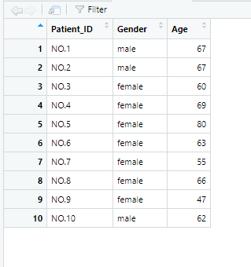
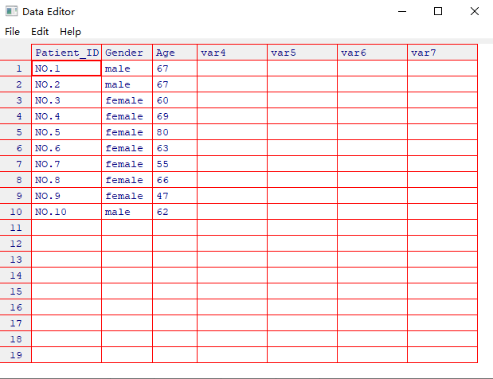
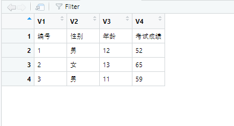
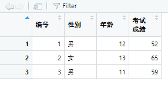
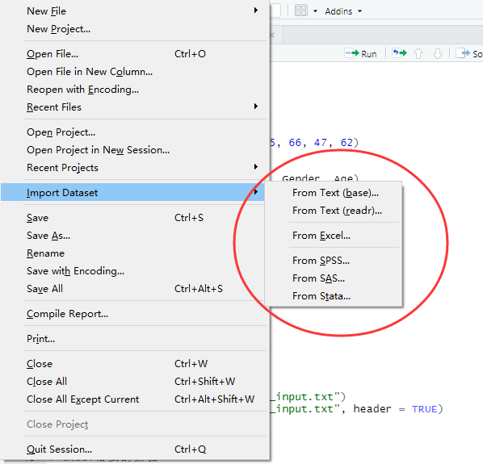
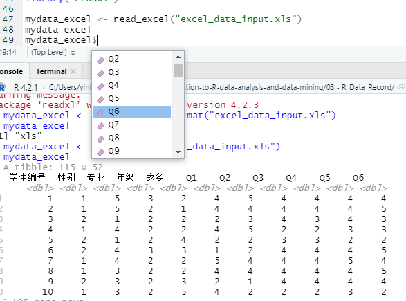

# 数据录入

## 手工录入

```R
# 键盘手工录入
Patient_ID <- c("No.1", "NO.2")
Patient_ID <- c("NO.1","NO.2",
                "NO.3","NO.4",
                "NO.5","NO.6",
                "NO.7","NO.8",
                "NO.9","NO.10")
Patient_ID

Gender <- c("male", "male", 
            "female", "female",
            "female", "female",
            "female", "female",
            "female", "male")
Gender

Age <- c(67, 67, 60, 69, 80, 63, 55, 66, 47, 62)
Age

mydata_01 <- data.frame(Patient_ID, Gender, Age)
mydata_01

View(mydata_01)
```

得到如下所示的结果：



接着进行修改：

```R
edit(mydatal)
```

得到的结果为：



但是仅此是不够的，如果要赋值给新的数据框，需要这样写：

```R
mydata_02 <- edit(mydata_01)
mydata_02
```

修改后的结果为：

```R
mydata_02 <- edit(mydata_01)
mydata_02
```

```R
> mydata_02
   Patient_ID Gender Age
1        NO.1   male  67
2        NO.2   male  67
3        NO.3 female  60
4        NO.4 female  69
5        NO.5 female  80
6        NO.6   male  63
7        NO.7 female  55
8        NO.8 female  66
9        NO.9 female  47
10      NO.10   male  62
```

如果要覆盖，方法其实非常的简单：

```R
> mydata_01
   Patient_ID Gender Age
1        NO.1   male  67
2        NO.2   male  67
3        NO.3 female  60
4        NO.4 female  69
5        NO.5 female  80
6        NO.6 female  63
7        NO.7 female  55
8        NO.8 female  66
9        NO.9 female  47
10      NO.10   male  62
> mydata_01 <- edit(mydata_01)
> mydata_01
   Patient_ID Gender Age
1        NO.1   male  67
2        NO.2   male  67
3        NO.3 female  60
4        NO.4 female  69
5        NO.5 female  80
6        NO.6   male  63
7        NO.7 female  55
8        NO.8 female  66
9        NO.9 female  47
10      NO.10   male  62
```

其实就是edit()函数不会默认覆盖被修改的数据框对象，需要进行赋值。

## txt格式数据的导入

这里需要使用read.table函数：

```txt
编号 性别 年龄 考试成绩
1 男 12 52
2 女 13 65
3 男 11 59
```

文件名为：txt_data_input.txt。

导入一如下所示：

```R
mydata_txt <- read.table("txt_data_input.txt")
```

得到的结果为：



添加一个参数header=TRUE：

```R
mydata_txt <- read.table("txt_data_input.txt", header = TRUE)
```



## Excel格式的数据

导入是可以鼠标点击导入的：



也可以使用代码来进行导入，需要使用的程序包是readxl程序包，但是readxl程序包并不是R软件自带的：

```R
install.packages("readxl")
library("readxl")
```

接着开始导入：

```R
> mydata_excel <- read_excel("excel_data_input.xls")
> mydata_excel
# A tibble: 115 × 52
   学生编号  性别  专业  年级  家乡    Q1    Q2    Q3    Q4    Q5    Q6
      <dbl> <dbl> <dbl> <dbl> <dbl> <dbl> <dbl> <dbl> <dbl> <dbl> <dbl>
 1        1     1     5     3     2     4     5     4     4     4     4
 2        2     1     5     2     1     4     4     4     4     4     5
 3        3     2     1     2     2     2     3     4     3     4     3
 4        4     1     4     2     2     4     5     2     2     3     3
 5        5     2     1     2     4     2     2     3     3     2     2
 6        6     2     4     3     3     1     2     4     4     4     5
 7        7     1     4     2     2     5     4     4     4     5     4
 8        8     1     3     2     2     4     4     4     4     4     5
 9        9     2     3     2     3     2     1     4     4     4     4
10       10     1     3     2     5     4     2     2     2     3     2
# ℹ 105 more rows
# ℹ 41 more variables: Q7 <dbl>, Q8 <dbl>, Q9 <dbl>, Q10 <dbl>, Q11 <dbl>,
#   Q12 <dbl>, Q13 <dbl>, Q14 <dbl>, Q15 <dbl>, Q16 <dbl>, Q17 <dbl>,
#   Q18 <dbl>, Q19 <dbl>, Q20 <dbl>, M1 <dbl>, M2 <dbl>, M3 <dbl>,
#   M4 <dbl>, M5 <dbl>, M6 <dbl>, M7 <dbl>, M8 <dbl>, M9 <dbl>, M10 <dbl>,
#   M11 <dbl>, M12 <dbl>, M13 <dbl>, M14 <dbl>, M15 <dbl>, M16 <dbl>,
#   M17 <dbl>, M18 <dbl>, M19 <dbl>, M20 <dbl>, M21 <dbl>, M22 <dbl>, …
# ℹ Use `print(n = ...)` to see more rows
```



首先修改一下数据的格式：

```R
> typeof(mydata_excel$性别)
[1] "double"
> mydata_excel$性别 <- factor(mydata_excel$性别, 
+                           levels = c(1, 2), labels = c('male', "female"))  # 将性别修改为分类变量
> typeof(mydata_excel$性别)
[1] "integer"
```

## CSV格式

csv文件可以使用read.csv()格式来进行导入，这个是R语言自带的：

```R
> # 导入csv格式数据
> mydata_csv <- read.csv("csv_data_input.csv")
> mydata_csv
   学生编号 性别 专业 年级 家乡 Q1 Q2 Q3 Q4 Q5 Q6 Q7 Q8 Q9 Q10 Q11 Q12 Q13
1         1    1    5    3    2  4  5  4  4  4  4  4  4  5   5   4   4   4
2         2    1    5    2    1  4  4  4  4  4  5  5  4  3   4   4   3   4
3         3    2    1    2    2  2  3  4  3  4  3  4  4  3   4   4   3   4
4         4    1    4    2    2  4  5  2  2  3  3  2  2  3   2   2   3   2
5         5    2    1    2    4  2  2  3  3  2  2  3  2  3   2   3   2   2
6         6    2    4    3    3  1  2  4  4  4  5  5  4  4   4   4   4   4
7         7    1    4    2    2  5  4  4  4  5  4  4  5  4   4   4   3   4
8         8    1    3    2    2  4  4  4  4  4  5  4  4  4   5   4   4   5
9         9    2    3    2    3  2  1  4  4  4  4  5  4  4   4   4   5   4
10       10    1    3    2    5  4  2  2  2  3  2  2  3  2   2   3   2   2
11       11    2    2    2    3  3  4  4  5  5  4  4  4  4   5   4   4   4
12       12    2    3    3    1  4  4  5  4  4  5  4  5  4   4   4   5   4
13       13    2    5    2    4  4  4  4  4  5  4  4  5  4   4   4   4   5
14       14    1    1    2    1  2  2  3  3  2  3  2  2  2   2   3   2   2
15       15    2    5    2    4  2  2  3  3  2  2  3  2  3   3   3   3   2
16       16    2    1    2    1  2  2  2  3  2  3  2  2  2   2   3   2   3
17       17    2    2    2    3  2  2  2  2  3  2  3  2  2   3   2   2   2
18       18    2    1    3    1  1  1  5  4  4  4  4  4  5   4   4   4   3
19       19    2    4    2    4  3  2  2  3  2  2  2  3  2   2   3   2   3
   Q14 Q15 Q16 Q17 Q18 Q19 Q20 M1 M2 M3 M4 M5 M6 M7 M8 M9 M10 M11 M12 M13
1    4   4   4   3   4   4   5  4  4  3  4  4  4  3  4  4   4   5   4   4
2    4   3   4   3   4   4   3  5  4  3  4  4  3  4  3  4   4   5   4   4
3    4   3   4   3   4   3   4  1  1  3  1  4  4  4  4  4   5   4   4   4
4    2   2   3   2   2   2   4  4  5  3  4  4  4  4  4  4   3   4   4   4
5    3   2   2   2   2   2   4  1  1  4  1  4  4  4  4  3   3   4   4   4
6    4   4   4   3   5   4   5  1  1  3  1  5  5  4  4  4   4   5   4   4
7    4   5   4   5   4   3   4  4  4  4  5  4  4  4  5  4   4   4   4   4
8    4   5   5   3   5   4   4  5  4  4  4  5  4  5  4  4   4   5   4   4
9    4   5   4   4   5   4   5  1  1  3  1  4  4  4  5  4   4   4   4   3
10   3   2   2   2   3   2   4  5  4  4  4  5  5  4  4  4   5   4   4   4
11   5   4   4   5   5   4   5  1  1  4  1  5  4  4  5  5   5   4   4   4
12   4   4   5   4   4   5   4  1  1  4  1  4  5  4  4  4   4   5   4   4
13   4   4   4   5   5   4   5  1  1  1  1  3  1  1  2  2   2   1   1   2
14   3   2   2   3   2   2   5  4  4  3  4  4  4  4  5  5   5   4   4   4
15   2   3   3   3   3   3   4  1  1  4  3  4  4  4  3  3   4   4   4   4
16   2   2   2   3   2   2   5  1  2  3  1  4  4  4  3  3   3   4   4   3
17   2   2   2   2   2   3   5  1  1  4  1  4  4  4  3  4   4   4   4   4
18   3   3   4   3   5   4   4  1  1  3  1  4  4  4  5  4   5   5   4   4
19   2   2   3   2   2   2   4  1  2  4  1  4  3  4  5  5   4   4   4   4
   M14 M15 M16 M17 M18 M19 M20 M21 M22 M23 M24 M25 M26 M27
1    4   4   3   4   5   4   3   3   4   4   3   4   4   4
2    4   3   4   4   4   5   4   3   4   4   2   4   3   4
3    3   3   4   4   4   4   4   4   3   3   4   3   3   3
4    3   4   4   4   5   4   4   4   3   3   4   3   3   3
5    3   3   4   4   4   4   3   3   3   4   4   3   4   3
6    4   3   4   5   4   3   4   5   4   3   4   4   4   4
7    4   4   5   5   4   5   4   4   3   3   2   4   4   4
8    3   3   4   4   3   4   3   3   4   4   4   4   4   4
9    4   4   4   5   5   4   2   3   4   3   4   3   4   3
10   4   3   5   5   4   4   4   4   3   3   4   4   3   4
11   4   4   4   5   5   5   2   3   4   4   4   4   4   4
12   4   4   5   5   5   4   4   4   3   3   4   5   3   4
13   1   1   2   3   2   1   4   4   3   3   2   4   4   2
14   4   4   5   5   4   4   3   2   2   3   2   3   3   4
15   4   4   3   3   3   4   4   4   3   3   2   4   4   4
16   3   3   4   3   4   4   2   2   3   4   4   3   3   3
17   3   3   4   4   4   4   4   4   3   3   4   4   3   3
18   4   4   5   4   5   4   4   4   3   4   3   4   4   4
19   4   4   5   5   4   5   3   3   4   4   3   4   4   4
 [ reached 'max' / getOption("max.print") -- omitted 96 rows ]
```

## 导入spss格式的数据

```R
> # 导入spss格式的数据
> library("haven")
Warning message:
package ‘haven’ was built under R version 4.2.3 
> mydata_spss <- read_sav("spss_data_input.sav")
> mydata_spss
# A tibble: 115 × 52
   学生编号 性别      专业     年级    家乡       Q1    Q2    Q3    Q4    Q5
      <dbl> <dbl+lbl> <dbl+lb> <dbl+l> <dbl+l> <dbl> <dbl> <dbl> <dbl> <dbl>
 1        1 1 [男]    5 [工学… 3 [研… 2 [镇]…     4     5     4     4     4
 2        2 1 [男]    5 [工学… 2 [研… 1 [农…     4     4     4     4     4
 3        3 2 [女]    1 [教育… 2 [研… 2 [镇]…     2     3     4     3     4
 4        4 1 [男]    4 [理学… 2 [研… 2 [镇]…     4     5     2     2     3
 5        5 2 [女]    1 [教育… 2 [研… 4 [县…     2     2     3     3     2
 6        6 2 [女]    4 [理学… 3 [研… 3 [县…     1     2     4     4     4
 7        7 1 [男]    4 [理学… 2 [研… 2 [镇]…     5     4     4     4     5
 8        8 1 [男]    3 [管理… 2 [研… 2 [镇]…     4     4     4     4     4
 9        9 2 [女]    3 [管理… 2 [研… 3 [县…     2     1     4     4     4
10       10 1 [男]    3 [管理… 2 [研… 5     …     4     2     2     2     3
# ℹ 105 more rows
# ℹ 42 more variables: Q6 <dbl>, Q7 <dbl>, Q8 <dbl>, Q9 <dbl>, Q10 <dbl>,
#   Q11 <dbl>, Q12 <dbl>, Q13 <dbl>, Q14 <dbl>, Q15 <dbl>, Q16 <dbl>,
#   Q17 <dbl>, Q18 <dbl>, Q19 <dbl>, Q20 <dbl>, M1 <dbl>, M2 <dbl>,
#   M3 <dbl>, M4 <dbl>, M5 <dbl>, M6 <dbl>, M7 <dbl>, M8 <dbl>, M9 <dbl>,
#   M10 <dbl>, M11 <dbl>, M12 <dbl>, M13 <dbl>, M14 <dbl>, M15 <dbl>,
#   M16 <dbl>, M17 <dbl>, M18 <dbl>, M19 <dbl>, M20 <dbl>, M21 <dbl>, …
# ℹ Use `print(n = ...)` to see more rows
```

