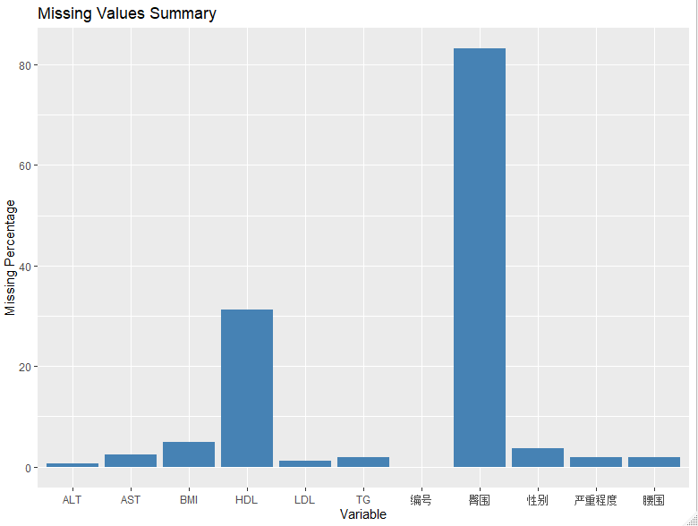

# 字符串变量整理

## 什么是字符串

```R
# 字符串变量的整理
# 什么是字符串：只需要使用"" 或者 ''，那么就是字符串
# 5 是一个数字，"5" 则是一个字符串

x <- 6
typeof(x)

x_str <- "6"
typeof(x_str)

x_vector <- c(1, 2, 3, 4, 5)
typeof(x_vector)

x_vector_2 <- c(1, 2, "3", "4", "5")
typeof(x_vector_2)
```

## 查找

导入一个数据集：

```R
> library(readxl)
> data_str <- read_xlsx("string_data.xlsx")
> data_str
# A tibble: 90 × 9
    排序 姓名编号     身份证号     性别  职业  婚姻状况 血型    BMI 饮食偏好
   <dbl> <chr>        <chr>        <chr> <chr> <chr>    <chr> <dbl> <chr>   
 1     1 张三12535    13030119951… 男    个体… 未婚     O      25.7 高脂肪… 
 2     2 李四1178536  13030120021… 女    NA    已婚     B      24.7 粗纤维… 
 3     3 张莎莎152    13030119931… 男    工人  已婚     A      29.1 粗纤维… 
 4     4 张静20123692 13030119841… 女    离退… 已婚     A      27.3 粗纤维… 
 5     5 张兰1025     13030119971… 男    离退… 已婚     AB     30.1 NA      
 6     6 李慧爱1023   13030119871… 男    离退… 已婚     B      27.7 高脂肪… 
 7     7 李丽莎201    13030119951… 女    离退… 已婚     O      24.6 NA      
 8     8 王五178      13030119951… 男    农民  已婚     B      30.4 粗纤维… 
 9     9 王来凤152    13030119901… 男    农民  已婚     B      21.0 NA      
10    10 王珊珊3699   13030119831… 女    离退… 已婚     O      22.1 粗纤维… 
# ℹ 80 more rows
# ℹ Use `print(n = ...)` to see more rows
```

开始进行探索：

```R
> # 求一下字符串的长度
> nchar(data_str$职业)
 [1]  3 NA  2  3  3  3  3  2  2  3  2  2  3  3  2  3  2  2  3  2  3  2  2  2
[25]  2  3  3  2  2  2  2  2  2  2  2  2  3  2  2  3  3 NA  2  2  3  3  3  2
[49]  3  3  3  3  3  2  3  2  2  2  2  2  2  2  2  2  2  2  3  2  2  2  4  3
[73]  2  3  3  3  2  3  2  3  2  2  3  3  2  2  3  3  2  2
```

查找：

```R
> # 查找：字符串的各个元素中是否包含了某一个字符/目标字符
> grep("辛辣", data_str$饮食偏好)
 [1]  1  8 19 21 22 25 26 30 36 38 40 53 60 61 63 64 68 80 86
> target_vector <- grep("辛辣", data_str$饮食偏好)
> target_vector
 [1]  1  8 19 21 22 25 26 30 36 38 40 53 60 61 63 64 68 80 86
> data_str[target_vector,]
# A tibble: 19 × 9
    排序 姓名编号      身份证号    性别  职业  婚姻状况 血型    BMI 饮食偏好
   <dbl> <chr>         <chr>       <chr> <chr> <chr>    <chr> <dbl> <chr>   
 1     1 张三12535     1303011995… 男    个体… 未婚     O      25.7 高脂肪… 
 2     8 王五178       1303011995… 男    农民  已婚     B      30.4 粗纤维… 
 3    19 刘岚102       1303011993… 男    离退… 已婚     B      26.7 粗纤维… 
 4    21 欧阳丽奇2013  1303011996… 男    个体… 已婚     B      26.7 高盐,辛…
 5    22 郑莹莹1485    1303012002… 女    农民  已婚     A      26.2 粗纤维… 
 6    25 周勤丽025932  1303011999… 男    其他  已婚     A      25.5 高盐,腌…
 7    26 王柳20148     1303011994… 女    离退… 已婚     B      25.2 粗纤维… 
 8    30 黄丽华8423    1303011996… 男    职员  已婚     O      23.5 高脂肪… 
 9    36 彭丽华97102   1303011992… 男    其他  已婚     B      20.9 辛辣    
10    38 胡有利10248   1303011983… 男    职员  已婚     O      29.1 辛辣    
11    40 张平来2657486 1303011982… 男    离退… 已婚     B      24.2 高盐,腌…
12    53 李辉华9876352 1303011989… 男    离退… 已婚     O      24.2 高脂肪… 
13    60 郭倩3135465   1303012002… 女    教师  已婚     B      20.2 辛辣,粗…
14    61 陈姗姗1453123 1303011995… 男    职员  未婚     O      19.6 高脂肪… 
15    63 邓娟娟9521    1303011990… 男    农民  已婚     AB     25.6 高脂肪… 
16    64 邓丽莎91115   1303011984… 男    职员  已婚     AB     21.5 高脂肪… 
17    68 袁雯雯12458   1303012001… 男    职员  已婚     O      31.3 粗纤维… 
18    80 马德岭841531  1303011994… 男    离退… 已婚     NA     22.7 粗纤维… 
19    86 周琳玲202952  1303011992… 男    农民  已婚     O      24.2 高脂肪… 
```

或者：

```R
> # 还可以使用grepl来进行查询
> grepl("辛辣", data_str$饮食偏好)
 [1]  TRUE FALSE FALSE FALSE FALSE FALSE FALSE  TRUE FALSE FALSE FALSE FALSE
[13] FALSE FALSE FALSE FALSE FALSE FALSE  TRUE FALSE  TRUE  TRUE FALSE FALSE
[25]  TRUE  TRUE FALSE FALSE FALSE  TRUE FALSE FALSE FALSE FALSE FALSE  TRUE
[37] FALSE  TRUE FALSE  TRUE FALSE FALSE FALSE FALSE FALSE FALSE FALSE FALSE
[49] FALSE FALSE FALSE FALSE  TRUE FALSE FALSE FALSE FALSE FALSE FALSE  TRUE
[61]  TRUE FALSE  TRUE  TRUE FALSE FALSE FALSE  TRUE FALSE FALSE FALSE FALSE
[73] FALSE FALSE FALSE FALSE FALSE FALSE FALSE  TRUE FALSE FALSE FALSE FALSE
[85] FALSE  TRUE FALSE FALSE FALSE FALSE
> as.numeric(grepl("辛辣", data_str$饮食偏好))
 [1] 1 0 0 0 0 0 0 1 0 0 0 0 0 0 0 0 0 0 1 0 1 1 0 0 1 1 0 0 0 1 0 0 0 0 0 1
[37] 0 1 0 1 0 0 0 0 0 0 0 0 0 0 0 0 1 0 0 0 0 0 0 1 1 0 1 1 0 0 0 1 0 0 0 0
[73] 0 0 0 0 0 0 0 1 0 0 0 0 0 1 0 0 0 0
> data_str$是否辛辣 <- as.numeric(grepl("辛辣", data_str$饮食偏好)) # 添加一个新的变量
> data_str$是否辛辣
 [1] 1 0 0 0 0 0 0 1 0 0 0 0 0 0 0 0 0 0 1 0 1 1 0 0 1 1 0 0 0 1 0 0 0 0 0 1
[37] 0 1 0 1 0 0 0 0 0 0 0 0 0 0 0 0 1 0 0 0 0 0 0 1 1 0 1 1 0 0 0 1 0 0 0 0
[73] 0 0 0 0 0 0 0 1 0 0 0 0 0 1 0 0 0 0
```

同样的，我们可以将所有的其他的数据都提取出来：

```R
> data_str$是否高脂肪饮食猪肉 <- as.numeric(grepl("高脂肪饮食猪肉", data_str$饮食偏好))
> data_str$是否高脂肪饮食猪肉
 [1] 1 0 0 0 0 1 0 1 0 0 1 0 1 0 0 1 0 0 0 0 0 1 0 0 0 0 0 0 0 1 0 1 0 0 0 0
[37] 0 0 0 0 0 0 1 0 0 0 1 1 0 1 1 0 1 0 0 0 0 1 1 0 1 0 1 1 0 1 0 0 0 0 0 0
[73] 0 0 0 0 0 0 1 0 0 0 0 0 0 1 0 0 0 0
> 
> data_str$是否牛肉 <- as.numeric(grepl("牛肉", data_str$饮食偏好))
> data_str$是否牛肉
 [1] 1 0 0 1 0 1 0 1 0 0 1 0 1 0 0 1 0 0 0 0 0 1 0 0 0 0 0 0 0 1 0 1 0 0 0 0
[37] 0 0 0 0 0 0 1 0 0 0 1 1 0 1 1 0 1 0 0 0 0 1 1 0 1 0 1 1 0 1 0 0 0 0 0 0
[73] 0 0 0 0 0 0 1 0 0 0 0 0 0 1 0 0 0 0
> 
> data_str$是否动物内脏 <- as.numeric(grepl("动物内脏", data_str$饮食偏好))
> data_str$是否动物内脏
 [1] 1 0 0 1 0 1 0 1 0 0 1 0 1 0 0 1 0 0 0 0 0 1 0 0 0 0 0 0 0 1 0 1 0 0 0 0
[37] 0 0 0 0 0 0 1 0 0 0 1 1 0 1 1 0 1 0 0 0 0 1 1 0 1 0 1 1 0 1 0 0 0 0 0 0
[73] 0 0 0 0 0 0 1 0 0 0 0 0 0 1 0 0 0 0
> 
> data_str$是否高盐 <- as.numeric(grepl("高盐", data_str$饮食偏好))
> data_str$是否高盐
 [1] 1 1 1 1 0 0 0 1 0 0 1 0 0 0 1 0 1 1 0 1 1 0 1 1 1 0 0 0 0 0 0 1 1 0 1 0
[37] 1 0 1 1 1 0 0 0 0 0 1 0 1 1 1 0 1 1 0 0 0 1 1 0 0 0 0 0 0 1 1 1 0 0 1 0
[73] 1 1 0 0 1 1 1 0 1 0 1 0 1 0 0 0 0 0
> 
> data_str$是否粗纤维饮食蔬菜 <- as.numeric(grepl("粗纤维饮食蔬菜", data_str$饮食偏好))
> data_str$是否粗纤维饮食蔬菜
 [1] 0 1 1 1 0 0 0 1 0 1 0 0 1 0 0 0 0 1 1 0 0 1 1 1 0 1 1 0 0 0 1 0 1 1 0 0
[37] 1 0 1 0 1 1 0 1 1 1 0 0 0 0 1 1 0 1 1 0 1 0 0 1 0 1 0 0 0 0 0 1 0 0 0 0
[73] 0 0 1 0 0 0 0 1 0 1 0 1 1 0 0 0 1 0
> 
> data_str$是否腌制食品 <- as.numeric(grepl("腌制食品", data_str$饮食偏好))
> data_str$是否腌制食品
 [1] 1 0 0 1 0 0 0 1 0 0 0 1 0 0 1 0 0 0 0 0 0 0 0 1 1 0 1 0 0 0 0 1 1 0 1 0
[37] 0 0 0 1 0 0 0 0 0 1 0 0 0 0 0 0 0 0 0 0 0 0 0 0 0 0 0 0 0 1 1 1 0 0 0 0
[73] 1 0 0 0 1 1 0 1 0 0 0 1 1 0 0 0 0 0
> 
> data_str$是否喜油腻 <- as.numeric(grepl("喜油腻", data_str$饮食偏好))
> data_str$是否喜油腻
 [1] 1 0 0 0 0 1 0 1 0 0 1 0 0 0 0 0 0 0 0 0 0 0 0 0 0 0 0 0 0 1 1 1 1 0 0 0
[37] 0 0 0 0 0 0 1 0 0 0 0 1 1 1 0 0 0 1 0 0 0 0 1 0 1 0 0 0 0 1 0 0 0 0 1 0
[73] 0 0 0 0 0 0 0 0 0 0 0 0 0 0 0 0 0 0
> 
> data_str$是否喜煎炸 <- as.numeric(grepl("喜煎炸", data_str$饮食偏好))
> data_str$是否喜煎炸
 [1] 0 0 0 0 0 0 0 1 0 0 1 0 0 0 0 0 0 0 0 0 0 1 0 0 0 0 0 1 0 0 0 0 0 0 0 0
[37] 0 0 0 0 0 0 0 0 0 0 0 1 1 0 0 0 0 0 0 0 0 0 0 0 1 0 1 0 0 1 0 0 0 0 1 0
[73] 0 0 1 0 0 0 0 0 0 0 0 0 0 0 0 0 0 0
> 
> data_str$是否水果 <- as.numeric(grepl("水果", data_str$饮食偏好))
> data_str$是否水果
 [1] 0 1 1 1 0 0 0 1 0 1 0 0 1 0 0 0 0 1 1 0 0 1 1 1 0 1 1 0 0 0 1 0 1 1 0 0
[37] 1 0 1 0 1 1 0 1 1 1 0 0 0 0 1 1 0 1 1 0 1 0 0 1 0 1 0 0 0 0 0 1 0 0 0 0
[73] 0 0 1 0 0 0 0 1 0 1 0 1 1 0 0 0 1 0
> 
> data_str$是否甜食 <- as.numeric(grepl("甜食", data_str$饮食偏好))
> data_str$是否甜食
 [1] 0 0 0 0 0 0 0 0 0 0 0 0 0 0 1 0 0 0 0 1 0 0 1 0 0 0 0 0 0 1 0 0 1 0 0 0
[37] 0 0 0 0 0 0 0 0 0 1 0 0 1 0 0 0 1 0 1 0 0 0 0 0 0 0 0 0 0 0 1 1 0 0 1 0
[73] 0 0 1 0 0 0 0 0 0 0 1 0 1 0 0 0 0 0
> 
> data_str$是否无特殊偏嗜 <- as.numeric(grepl("无特殊偏嗜", data_str$饮食偏好))
> data_str$是否无特殊偏嗜
 [1] 0 0 0 0 0 0 0 0 0 0 0 0 0 0 0 0 0 0 0 0 0 0 0 0 0 0 0 1 0 0 0 0 0 0 0 0
[37] 0 0 0 0 0 0 0 0 0 0 0 0 0 0 0 0 0 0 0 0 0 0 0 0 0 0 0 0 0 0 0 0 1 1 0 0
[73] 0 0 0 1 0 0 0 0 0 0 0 0 0 0 0 0 0 0
```

## 提取

以身份证号为例子：

```R
1303011995111X
```

其中：

- 130301 是地区
- 1995 是年份
- 111x 则是具体的身份信息

现在要做的是将年份提取出来：

```R
> ## 提取
> data_str$出生年份 <- substr(data_str$身份证号, 7, 10)  # 将7~10，包括7和10
> str(data_str)
tibble [90 × 22] (S3: tbl_df/tbl/data.frame)
 $ 排序              : num [1:90] 1 2 3 4 5 6 7 8 9 10 ...
 $ 姓名编号          : chr [1:90] "张三12535" "李四1178536" "张莎莎152" "张静20123692" ...
 $ 身份证号          : chr [1:90] "1303011995111X" "1303012002112X" "1303011993121X" "1303011984122X" ...
 $ 性别              : chr [1:90] "男" "女" "男" "女" ...
 $ 职业              : chr [1:90] "个体户" NA "工人" "离退休" ...
 $ 婚姻状况          : chr [1:90] "未婚" "已婚" "已婚" "已婚" ...
 $ 血型              : chr [1:90] "O" "B" "A" "A" ...
 $ BMI               : num [1:90] 25.7 24.7 29.1 27.3 30.1 ...
 $ 饮食偏好          : chr [1:90] "高脂肪饮食猪肉、牛肉、动物内脏,高盐,腌制食品,辛辣,喜油腻" "粗纤维饮食蔬菜、水果,高盐" "粗纤维饮食蔬菜、水果,高盐" "粗纤维饮食蔬菜、水果,牛肉、动物内脏,高盐,腌制食品" ...
 $ 是否辛辣          : num [1:90] 1 0 0 0 0 0 0 1 0 0 ...
 $ 是否高脂肪饮食猪肉: num [1:90] 1 0 0 0 0 1 0 1 0 0 ...
 $ 是否牛肉          : num [1:90] 1 0 0 1 0 1 0 1 0 0 ...
 $ 是否动物内脏      : num [1:90] 1 0 0 1 0 1 0 1 0 0 ...
 $ 是否高盐          : num [1:90] 1 1 1 1 0 0 0 1 0 0 ...
 $ 是否粗纤维饮食蔬菜: num [1:90] 0 1 1 1 0 0 0 1 0 1 ...
 $ 是否腌制食品      : num [1:90] 1 0 0 1 0 0 0 1 0 0 ...
 $ 是否喜油腻        : num [1:90] 1 0 0 0 0 1 0 1 0 0 ...
 $ 是否喜煎炸        : num [1:90] 0 0 0 0 0 0 0 1 0 0 ...
 $ 是否水果          : num [1:90] 0 1 1 1 0 0 0 1 0 1 ...
 $ 是否甜食          : num [1:90] 0 0 0 0 0 0 0 0 0 0 ...
 $ 是否无特殊偏嗜    : num [1:90] 0 0 0 0 0 0 0 0 0 0 ...
 $ 出生年份          : chr [1:90] "1995" "2002" "1993" "1984" ...
```

可以发现提取出来的时候其实是作为char，或者说categories，所以这里需要修改为num：

```R
> data_str$出生年份 <- as.numeric(data_str$出生年份)
> str(data_str$出生年份)
 num [1:90] 1995 2002 1993 1984 1997 ...
```

## 替换/删除

以名字为例：

```R
张三12535
李四1178536
张莎莎152
张静20123692
```

如何只保留名字呢？

```R
> ## 替换/删除
> ### gsub("被替换的内容", "替换内容", 字符串)
> gsub('[0-9]', '', data_str$姓名编号)
 [1] "张三"     "李四"     "张莎莎"   "张静"     "张兰"     "李慧爱"  
 [7] "李丽莎"   "王五"     "王来凤"   "王珊珊"   "王毅"     "刘雪莲"  
[13] "刘丽丽"   "程立辉"   "张立强"   "兰慧业"   "张立伟"   "秦佳佳"  
[19] "刘岚"     "诸葛丽慧" "欧阳丽奇" "郑莹莹"   "张丽"     "周倩"    
[25] "周勤丽"   "王柳"     "孙文文"   "孙立群"   "王立宇"   "黄丽华"  
[31] "黄立伟"   "黄伟"     "郭晓丽"   "张万功"   "彭珊珊"   "彭丽华"  
[37] "刘琴琴"   "胡有利"   "李辉"     "张平来"   "王婉婉"   "罗梅"    
[43] "韩梅梅"   "韩丽红"   "林文凯"   "林华全"   "林强"     "张万鸥"  
[49] "王飞"     "王艺颖"   "张德芬"   "王德龙"   "李辉华"   "李明达"  
[55] "王鹏鸣"   "周卫华"   "郑萍"     "刘克明"   "黄梦君"   "郭倩"    
[61] "陈姗姗"   "王思思"   "邓娟娟"   "邓丽莎"   "王万华"   "李欣"    
[67] "廖珊珊"   "袁雯雯"   "张京华"   "王立山"   "谢万华"   "谢开明"  
[73] "刘伶俐"   "兰明宇"   "王再华"   "潘明旭"   "潘莎莎"   "王坤坤"  
[79] "黄德利"   "马德岭"   "马万华"   "张婉玲"   "张菲菲"   "王明明"  
[85] "周莎莉"   "周琳玲"   "周林柚"   "王章华"   "刘康丽"   "彭敏"  
```

开始进行替换：

```R
> data_str$姓名 <- gsub('[0-9]', '', data_str$姓名编号)
> data_str$姓名
 [1] "张三"     "李四"     "张莎莎"   "张静"     "张兰"     "李慧爱"  
 [7] "李丽莎"   "王五"     "王来凤"   "王珊珊"   "王毅"     "刘雪莲"  
[13] "刘丽丽"   "程立辉"   "张立强"   "兰慧业"   "张立伟"   "秦佳佳"  
[19] "刘岚"     "诸葛丽慧" "欧阳丽奇" "郑莹莹"   "张丽"     "周倩"    
[25] "周勤丽"   "王柳"     "孙文文"   "孙立群"   "王立宇"   "黄丽华"  
[31] "黄立伟"   "黄伟"     "郭晓丽"   "张万功"   "彭珊珊"   "彭丽华"  
[37] "刘琴琴"   "胡有利"   "李辉"     "张平来"   "王婉婉"   "罗梅"    
[43] "韩梅梅"   "韩丽红"   "林文凯"   "林华全"   "林强"     "张万鸥"  
[49] "王飞"     "王艺颖"   "张德芬"   "王德龙"   "李辉华"   "李明达"  
[55] "王鹏鸣"   "周卫华"   "郑萍"     "刘克明"   "黄梦君"   "郭倩"    
[61] "陈姗姗"   "王思思"   "邓娟娟"   "邓丽莎"   "王万华"   "李欣"    
[67] "廖珊珊"   "袁雯雯"   "张京华"   "王立山"   "谢万华"   "谢开明"  
[73] "刘伶俐"   "兰明宇"   "王再华"   "潘明旭"   "潘莎莎"   "王坤坤"  
[79] "黄德利"   "马德岭"   "马万华"   "张婉玲"   "张菲菲"   "王明明"  
[85] "周莎莉"   "周琳玲"   "周林柚"   "王章华"   "刘康丽"   "彭敏"
```

同样的，如果要删除姓名，则使用：

```R
'[^0-9]'
```

^ 表示的是除了阿拉伯数字之外的所有内容，也就是补集：

```
> gsub('[^0-9]', '', data_str$姓名编号)
 [1] "12535"     "1178536"   "152"       "20123692"  "1025"      "1023"     
 [7] "201"       "178"       "152"       "3699"      "2036"      "852"      
[13] "621"       "105"       "9856"      "854"       "9853"      "752310"   
[19] "102"       "98452"     "2013"      "1485"      "0236"      "2015"     
[25] "025932"    "20148"     "20125"     "9412"      "302154"    "8423"     
[31] "20155"     "85412"     "86937"     "845614"    "0879"      "97102"    
[37] "8145"      "10248"     "98713"     "2657486"   "63205"     "20985"    
[43] "9842003"   "84200"     "9814020"   "2123456"   "67413"     "647813"   
[49] "30262"     "39641"     "2038414"   "981422"    "9876352"   "341520"   
[55] "5151236"   "98420314"  "459312"    "195322"    "148523"    "3135465"  
[61] "1453123"   "453126994" "9521"      "91115"     "4546231"   "1456487"  
[67] "15648612"  "12458"     "123"       "9531"      "12358698"  "15256"    
[73] "152674"    "1222226"   "25865"     "1546"      "2360745"   "125458"   
[79] "02158"     "841531"    "12058745"  "94512"     "20645"     "981230"   
[85] "2120564"   "202952"    "21355984"  "02365486"  "9820"      "9741530"  
> data_str$编号 <- gsub('[^0-9]', '', data_str$姓名编号)
> data_str$编号
 [1] "12535"     "1178536"   "152"       "20123692"  "1025"      "1023"     
 [7] "201"       "178"       "152"       "3699"      "2036"      "852"      
[13] "621"       "105"       "9856"      "854"       "9853"      "752310"   
[19] "102"       "98452"     "2013"      "1485"      "0236"      "2015"     
[25] "025932"    "20148"     "20125"     "9412"      "302154"    "8423"     
[31] "20155"     "85412"     "86937"     "845614"    "0879"      "97102"    
[37] "8145"      "10248"     "98713"     "2657486"   "63205"     "20985"    
[43] "9842003"   "84200"     "9814020"   "2123456"   "67413"     "647813"   
[49] "30262"     "39641"     "2038414"   "981422"    "9876352"   "341520"   
[55] "5151236"   "98420314"  "459312"    "195322"    "148523"    "3135465"  
[61] "1453123"   "453126994" "9521"      "91115"     "4546231"   "1456487"  
[67] "15648612"  "12458"     "123"       "9531"      "12358698"  "15256"    
[73] "152674"    "1222226"   "25865"     "1546"      "2360745"   "125458"   
[79] "02158"     "841531"    "12058745"  "94512"     "20645"     "981230"   
[85] "2120564"   "202952"    "21355984"  "02365486"  "9820"      "9741530"  
```

使用substr函数其实也可以进行替换：

```R
> ### substr(字符串, 开始位置, 结束位置)
> data_str$隐匿年份 <- data_str$身份证号
> subset(data_str$隐匿年份, 7, 10) <- "XXXX"
Error in subset(data_str$隐匿年份, 7, 10) <- "XXXX" : 
  could not find function "subset<-"
> substr(data_str$隐匿年份, 7, 10) <- "XXXX"
> data_str$隐匿年份
 [1] "130301XXXX111X" "130301XXXX112X" "130301XXXX121X" "130301XXXX122X"
 [5] "130301XXXX122X" "130301XXXX101X" "130301XXXX111X" "130301XXXX111X"
 [9] "130301XXXX102X" "130301XXXX121X" "130301XXXX123X" "130301XXXX112X"
[13] "130301XXXX101X" "130301XXXX102X" "130301XXXX113X" "130301XXXX102X"
[17] "130301XXXX112X" "130301XXXX112X" "130301XXXX121X" "130301XXXX111X"
[21] "130301XXXX111X" "130301XXXX102X" "130301XXXX122X" "130301XXXX111X"
[25] "130301XXXX101X" "130301XXXX121X" "130301XXXX122X" "130301XXXX112X"
[29] "130301XXXX102X" "130301XXXX102X" "130301XXXX121X" "130301XXXX121X"
[33] "130301XXXX102X" "130301XXXX122X" "130301XXXX111X" "130301XXXX122X"
[37] "130301XXXX122X" "130301XXXX111X" "130301XXXX101X" "130301XXXX121X"
[41] "130301XXXX102X" "130301XXXX122X" "130301XXXX102X" "130301XXXX111X"
[45] "130301XXXX101X" "130301XXXX112X" "130301XXXX122X" "130301XXXX112X"
[49] "130301XXXX121X" "130301XXXX102X" "130301XXXX111X" "130301XXXX121X"
[53] "130301XXXX101X" "130301XXXX101X" "130301XXXX121X" "130301XXXX111X"
[57] "130301XXXX113X" "130301XXXX112X" "130301XXXX111X" "130301XXXX102X"
[61] "130301XXXX121X" "130301XXXX111X" "130301XXXX122X" "130301XXXX101X"
[65] "130301XXXX121X" "130301XXXX111X" "130301XXXX102X" "130301XXXX102X"
[69] "130301XXXX101X" "130301XXXX112X" "130301XXXX121X" "130301XXXX112X"
[73] "130301XXXX112X" "130301XXXX112X" "130301XXXX112X" "130301XXXX122X"
[77] "130301XXXX112X" "130301XXXX101X" "130301XXXX101X" "130301XXXX102X"
[81] "130301XXXX101X" "130301XXXX122X" "130301XXXX102X" "130301XXXX112X"
[85] "130301XXXX112X" "130301XXXX101X" "130301XXXX101X" "130301XXXX112X"
[89] "130301XXXX101X" "130301XXXX102X"
```

## 黏贴/复制

```R
> ### 黏贴
> #### paste(变量1, 变量2, sep = "❤)
> data_str$姓名编号_新 <- paste(data_str$姓名, data_str$编号, sep = "❤")
> data_str$姓名编号_新
 [1] "张三❤12535"       "李四❤1178536"     "张莎莎❤152"      
 [4] "张静❤20123692"    "张兰❤1025"        "李慧爱❤1023"     
 [7] "李丽莎❤201"       "王五❤178"         "王来凤❤152"      
[10] "王珊珊❤3699"      "王毅❤2036"        "刘雪莲❤852"      
[13] "刘丽丽❤621"       "程立辉❤105"       "张立强❤9856"     
[16] "兰慧业❤854"       "张立伟❤9853"      "秦佳佳❤752310"   
[19] "刘岚❤102"         "诸葛丽慧❤98452"   "欧阳丽奇❤2013"   
[22] "郑莹莹❤1485"      "张丽❤0236"        "周倩❤2015"       
[25] "周勤丽❤025932"    "王柳❤20148"       "孙文文❤20125"    
[28] "孙立群❤9412"      "王立宇❤302154"    "黄丽华❤8423"     
[31] "黄立伟❤20155"     "黄伟❤85412"       "郭晓丽❤86937"    
[34] "张万功❤845614"    "彭珊珊❤0879"      "彭丽华❤97102"    
[37] "刘琴琴❤8145"      "胡有利❤10248"     "李辉❤98713"      
[40] "张平来❤2657486"   "王婉婉❤63205"     "罗梅❤20985"      
[43] "韩梅梅❤9842003"   "韩丽红❤84200"     "林文凯❤9814020"  
[46] "林华全❤2123456"   "林强❤67413"       "张万鸥❤647813"   
[49] "王飞❤30262"       "王艺颖❤39641"     "张德芬❤2038414"  
[52] "王德龙❤981422"    "李辉华❤9876352"   "李明达❤341520"   
[55] "王鹏鸣❤5151236"   "周卫华❤98420314"  "郑萍❤459312"     
[58] "刘克明❤195322"    "黄梦君❤148523"    "郭倩❤3135465"    
[61] "陈姗姗❤1453123"   "王思思❤453126994" "邓娟娟❤9521"     
[64] "邓丽莎❤91115"     "王万华❤4546231"   "李欣❤1456487"    
[67] "廖珊珊❤15648612"  "袁雯雯❤12458"     "张京华❤123"      
[70] "王立山❤9531"      "谢万华❤12358698"  "谢开明❤15256"    
[73] "刘伶俐❤152674"    "兰明宇❤1222226"   "王再华❤25865"    
[76] "潘明旭❤1546"      "潘莎莎❤2360745"   "王坤坤❤125458"   
[79] "黄德利❤02158"     "马德岭❤841531"    "马万华❤12058745" 
[82] "张婉玲❤94512"     "张菲菲❤20645"     "王明明❤981230"   
[85] "周莎莉❤2120564"   "周琳玲❤202952"    "周林柚❤21355984" 
[88] "王章华❤02365486"  "刘康丽❤9820"      "彭敏❤9741530"
```

# 时间日期整理

## 什么是日期向量

```R
# 日期变量的整理
a <- c(1, 2, 3, 4)  # 数值型向量
b <- c("上海", "北京", "广州", "深圳", )  # 字符型向量
d <- c(TRUE, TRUE, FALSE, FALSE )  # 逻辑型向量

# 日期向量  YYYY-mm-dd                    DATE
# 时间向量  YYYY-mm-dd HH:MM:SS           POSIXct

date_01 <- c("2022-11-22", "2022-11-01", "2022-11-03")  # 日期向量
date_01 <- as.Date(date_01)  # 转换为日期

# 只有转换为Date才能够计算日期差
date_02 <- c('2022-11-22 17:06:23', '2022-11-01 12:35:29', '2022-11-03 21:18:09')
date_02 <- as.POSIXct(date_02)
```

如果没有转换为Date向量，那么向量就是Char向量，无法用来计算日期差或者时间差。

尝试进行计算：

```R
> date_02[2]
[1] "2022-11-01 12:35:29 ACDT"
> date_02[2] - date_02[1]
Time difference of -21.18812 days
```

## lubridate包

Lubridate是R语言中一个流行的日期和时间处理包，它提供了一组简单且一致的函数，用于解析、操作和格式化日期和时间数据。该包的目标是使日期和时间处理更加直观、易用，并且提供与常见任务相关的便利函数。

下面是Lubridate包的一些主要功能和特点：

1. 解析和创建日期时间对象：Lubridate可以将各种常见的日期时间格式（如字符向量、数值向量、POSIXt等）解析为日期时间对象。它还提供了一系列函数，用于直接创建日期时间对象，如`ymd()`（年-月-日）、`dmy()`（日-月-年）等。
2. 提供友好的函数命名：Lubridate的函数采用直观的命名约定，使得处理日期和时间更加简单和易懂。例如，你可以使用`year()`、`month()`、`day()`函数从日期时间对象中提取年、月、日等信息。
3. 支持时区处理：Lubridate可以处理不同时区的日期和时间数据。它提供了函数来设置和获取时区信息，并可以在不同时区之间进行转换。
4. 时间间隔和持续时间的计算：Lubridate提供了一些函数来计算日期和时间之间的差异，比如`time_length()`可以计算两个日期之间的时间长度，`interval()`可以创建一个时间间隔对象。
5. 方便的日期时间操作：Lubridate具有丰富的日期时间操作函数。它可以让你轻松地进行日期时间的加减、舍入、截断等操作，如`update()`、`round_date()`、`floor_date()`等。
6. 格式化和解析日期时间字符串：Lubridate提供了函数来格式化日期和时间的输出，以便与常见的日期时间格式进行匹配。它还支持从自定义的日期时间字符串中解析出日期时间对象。
7. 兼容性和整合性：Lubridate与R的其他核心包和第三方包兼容良好，可以与其他数据处理和可视化包无缝整合使用。它还提供了对数据框的扩展，使你能够轻松地处理和操作包含日期时间列的数据。

总的来说，Lubridate是一个功能强大且易于使用的R包，旨在简化日期和时间处理的任务。它的直观的函数命名和丰富的功能使得处理和操作日期时间数据变得更加方便和高效。无论你是进行数据分析、时间序列分析还是其他与日期时间相关的任务，Lubridate都是一个值得考虑的优秀选择。

首先需要安装：

```R
install.packages("lubridate")
```

然后加载：

```R
# 加载
library("lubridate")
```

我们可以尝试提取某一个日期向量中的数据：

```R
> year(date_01)
[1] 2022 2022 2022
> month(date_01)
[1] 11 11 11
> day(date_01)
[1] 22  1  3
> quarter(date_01)
[1] 4 4 4
```

同样的：

```R
> year(date_02)
[1] 2022 2022 2022
> month(date_02)
[1] 11 11 11
> day(date_02)
[1] 22  1  3
> quarter(date_02)
[1] 4 4 4
> hour(date_02)
[1] 17 12 21
> minute(date_02)
[1]  6 35 18
> second(date_02)
[1] 23 29  9
```

开始进行加减法操作：

```R
> # 加减法
> date_01
[1] "2022-11-22" "2022-11-01" "2022-11-03"
> date_03 <- date_01 + 3  # 向量中的每一个日期都增加了3天
> date_03
[1] "2022-11-25" "2022-11-04" "2022-11-06"
> 
> date_02
[1] "2022-11-22 17:06:23 ACDT" "2022-11-01 12:35:29 ACDT"
[3] "2022-11-03 21:18:09 ACDT"
> date_04 <- date_02 + 4  # 向量中的每一个日期都增加了4秒
> date_04
[1] "2022-11-22 17:06:27 ACDT" "2022-11-01 12:35:33 ACDT"
[3] "2022-11-03 21:18:13 ACDT"
```

## 对日期文件进行操作

导入数据：

```R
> date_df <- read_excel("date_data.xlsx")
Error in read_excel("date_data.xlsx") : 
  could not find function "read_excel"
> library(readxl)
Warning message:
package ‘readxl’ was built under R version 4.2.3 
> date_data <- read_excel("date_data.xlsx")
```

检查数据集：

```R
> # 开始进行操作
> View(date_data)
> str(date_data)
tibble [30 × 6] (S3: tbl_df/tbl/data.frame)
 $ 患者编号    : chr [1:30] "NO.1" "NO.2" "NO.3" "NO.4" ...
 $ 入院日期    : POSIXct[1:30], format: "2022-06-25" "2022-07-02" ...
 $ 手术日期    : POSIXct[1:30], format: "2022-06-26" "2022-07-03" ...
 $ 手术开始时间: chr [1:30] "08:06:33" "08:04:01" "08:06:13" "08:05:16" ...
 $ 手术结束时间: chr [1:30] "09:35:55" "10:53:25" "10:46:32" "09:45:47" ...
 $ 出院日期    : POSIXct[1:30], format: "2022-10-02" "2022-10-17" ...
```

修改入院日期的格式，从POSIXct修改为Date：

```R
> str(date_data$入院日期)
 POSIXct[1:30], format: "2022-06-25" "2022-07-02" "2022-06-11" "2022-05-08" "2022-05-03" "2022-06-15" ...
> ymd(date_data$入院日期)
 [1] "2022-06-25" "2022-07-02" "2022-06-11" "2022-05-08" "2022-05-03" "2022-06-15" "2022-07-04"
 [8] "2022-05-20" "2022-05-02" "2022-05-07" "2022-05-23" "2022-05-09" "2022-05-19" "2022-05-13"
[15] "2022-06-01" "2022-06-06" "2022-05-05" "2022-05-10" "2022-06-05" "2022-05-15" "2022-06-07"
[22] "2022-06-24" "2022-05-04" "2022-06-02" "2022-06-10" "2022-05-16" "2022-06-28" "2022-06-14"
[29] "2022-06-12" "2022-06-26"
> str(ymd(date_data$入院日期))
 Date[1:30], format: "2022-06-25" "2022-07-02" "2022-06-11" "2022-05-08" "2022-05-03" "2022-06-15" ...
> date_data$入院日期 <- ymd(date_data$入院日期)
> str(date_data$入院日期)
 Date[1:30], format: "2022-06-25" "2022-07-02" "2022-06-11" "2022-05-08" "2022-05-03" "2022-06-15" ...
```

同样的还有手术日期：

```R
> date_data$手术日期 <- ymd(date_data$手术日期)
```

接着生成正确的时间变量：

```R
> # 生成正确的时间变量
> date_data$手术开始_完整时间 <- paste(date_data$手术日期, 
+                              date_data$手术开始时间, spe = " ")
> # 同理，手术完成的时间
> date_data$手术结束_完整时间 <- paste(date_data$手术日期, date_data$手术结束时间, sep = " ")
> date_data$手术结束_完整时间
 [1] "2022-06-26 09:35:55" "2022-07-03 10:53:25" "2022-06-14 10:46:32" "2022-05-11 09:45:47"
 [5] "2022-05-06 12:17:31" "2022-06-18 09:42:53" "2022-07-07 10:30:30" "2022-05-22 08:33:55"
 [9] "2022-05-05 08:22:21" "2022-05-09 08:37:35" "2022-05-25 12:32:44" "2022-05-11 08:20:29"
[13] "2022-05-20 12:52:36" "2022-05-15 08:11:38" "2022-06-03 10:26:57" "2022-06-07 09:10:40"
[17] "2022-05-06 08:24:20" "2022-05-13 09:50:54" "2022-06-07 10:13:42" "2022-05-16 11:40:23"
[21] "2022-06-10 08:56:33" "2022-06-26 08:49:49" "2022-05-05 09:27:50" "2022-06-03 12:43:24"
[25] "2022-06-13 12:54:51" "2022-05-18 08:36:39" "2022-07-01 11:58:45" "2022-06-15 10:59:41"
[29] "2022-06-13 09:57:28" "2022-06-27 10:36:37"
```

接着使用class()来检测一下：

```R
> # class()检测
> class(date_data$手术开始_完整时间)
[1] "character"
> class(date_data$手术结束_完整时间)
[1] "character"
```

可以发现这些都是character，而不是Date或者POSIXct。

开始进行修改：

```R
> # 开始修改成正确的格式
> date_data$出院日期 <- ymd(date_data$出院日期)
> date_data$手术开始_完整时间 <- ymd_hms(date_data$手术开始_完整时间)
> date_data$手术结束_完整时间 <- ymd_hms(date_data$手术结束_完整时间)
> str(date_data)
tibble [30 × 8] (S3: tbl_df/tbl/data.frame)
 $ 患者编号         : chr [1:30] "NO.1" "NO.2" "NO.3" "NO.4" ...
 $ 入院日期         : Date[1:30], format: "2022-06-25" "2022-07-02" "2022-06-11" ...
 $ 手术日期         : Date[1:30], format: "2022-06-26" "2022-07-03" "2022-06-14" ...
 $ 手术开始时间     : chr [1:30] "08:06:33" "08:04:01" "08:06:13" "08:05:16" ...
 $ 手术结束时间     : chr [1:30] "09:35:55" "10:53:25" "10:46:32" "09:45:47" ...
 $ 出院日期         : Date[1:30], format: "2022-10-02" "2022-10-17" "2022-09-19" ...
 $ 手术开始_完整时间: POSIXct[1:30], format: "2022-06-26 08:06:33" "2022-07-03 08:04:01" "2022-06-14 08:06:13" ...
 $ 手术结束_完整时间: POSIXct[1:30], format: "2022-06-26 09:35:55" "2022-07-03 10:53:25" "2022-06-14 10:46:32" ...
```

接着开始计算时间差，首先计算手术等待的时间：

```R
# 计算时间差
date_data$手术等待时间 <- difftime(date_data$手术日期, 
                             date_data$入院日期, 
                             units = "days")
date_data$手术等待时间
mean(date_data$手术等待时间)
```

接着计算手术的时长：

```R
> # 计算手术的时长
> date_data$手术时长 <- difftime(date_data$手术结束_完整时间,
+                            date_data$手术开始_完整时间, units = "hours")
> date_data$手术时长
Time differences in hours
 [1] 1.4894444 2.8233333 2.6719444 1.6752778 4.2122222 1.6666667 2.3855556 0.5222222 0.2922222
[10] 0.5227778 4.4486111 0.2816667 4.8302778 0.1080556 2.3611111 1.0605556 0.3305556 1.8061111
[19] 2.1175000 3.6022222 0.8855556 0.7316667 1.3644444 4.6025000 4.8019444 0.5213889 3.8788889
[28] 2.8794444 1.9041667 2.5344444
> mean(date_data$手术时长)
Time difference of 2.110426 hours
```

最后可以将处理之后的数据集存起来：

```R
write.csv(x = date_data, file = "date_data_clean.csv")
```

# 缺失值

## R语言的缺失值

R语言的缺失值有这样的几种表达方式：NA，意思为 not available。

## 缺失值的计算

如下所示：

```R
> # 创建缺失值
> score <- c(92, 91, NA, 62, 85, 88, NA, 92, NA)
> score
[1] 92 91 NA 62 85 88 NA 92 NA
> 
> # 缺失值数量计算
> ## 缺失值数量计算使用summary()函数
> summary(score)
   Min. 1st Qu.  Median    Mean 3rd Qu.    Max.    NA's 
  62.00   85.75   89.50   85.00   91.75   92.00       3 
```

summary给出了NA的值为3。

如何计算更加准确的位置：

```R
> ## 计算这一个位置的值是否是NA
> is.na(score)
[1] FALSE FALSE  TRUE FALSE FALSE FALSE  TRUE FALSE  TRUE
> 
> ## 使用which函数查找缺失值的位置
> which(is.na(score))
[1] 3 7 9
```

如何忽略缺失值：

```R
> na.omit(score)
[1] 92 91 62 85 88 92
attr(,"na.action")
[1] 3 7 9
attr(,"class")
[1] "omit"
```

计算一下：

```R
> ## 计算
> mean(score)
[1] NA
> mean(na.omit(score))
[1] 85
```

如果值中存在着NA，那么最终的输出的结果也是NA，需要将这些NA的值去除，才能够进行进一步的计算。

## 不同情况的缺失值的考虑

三种缺失值的处理方法：

1. 缺失值较多：NA > 80%，则直接删除
2. 缺失值在可以接受的范围：30% ~ 80%，那么可以将缺失值单独作为一个类别来进行探索
3. 缺失值比较少：0% ~ 30%，采用对缺失值进行填补的方式来处理

缺失值较多（NA > 80%）时，直接删除缺失值：

```
RCopy code# 生成含有较多缺失值的数据
set.seed(1)
data <- data.frame(
  x = rnorm(100),
  y = rnorm(100),
  z = rep(NA, 100)  # 生成全部为NA的变量
)

# 计算每个变量的缺失值比例
missing_percentage <- colMeans(is.na(data))

# 根据缺失值比例删除变量
data_cleaned <- data[, missing_percentage < 0.8]
```

缺失值在可以接受的范围（30% ~ 80%）时，将缺失值单独作为一个类别来进行探索：

```
RCopy code# 生成含有可接受范围内缺失值的数据
set.seed(1)
data <- data.frame(
  x = rnorm(100),
  y = rnorm(100),
  z = sample(c(1, 2, 3, NA), 100, replace = TRUE)  # 生成包含缺失值的变量
)

# 将缺失值视为单独的类别，进行探索
data$z_category <- ifelse(is.na(data$z), "Missing", as.character(data$z))
```

缺失值比较少（0% ~ 30%）时，采用对缺失值进行填补的方式来处理：

```
RCopy code# 生成含有较少缺失值的数据
set.seed(1)
data <- data.frame(
  x = rnorm(100),
  y = rnorm(100),
  z = rnorm(100)
)

# 为缺失值进行填补
library(mice)  # 使用mice包进行填补

# 创建mice对象
mice_object <- mice(data, m = 5)  # m指定进行填补的迭代次数

# 执行填补操作
data_imputed <- complete(mice_object)
```

以上代码演示了三种不同情况下对缺失值进行处理的方法。在实际应用中，你需要根据数据集的特点和分析目标选择适当的处理方式。

## 使用数据集进行实操

导入数据集和实用summary()来进行检查：

```R
> # 检查数据集中的missing value
> summary(missing_df)
     编号               性别                BMI           严重程度         腰围       
 Length:160         Length:160         Min.   :16.30   Min.   :1.00   Min.   : 59.00  
 Class :character   Class :character   1st Qu.:21.41   1st Qu.:2.00   1st Qu.: 79.00  
 Mode  :character   Mode  :character   Median :23.75   Median :3.00   Median : 85.00  
                                       Mean   :23.87   Mean   :2.49   Mean   : 84.61  
                                       3rd Qu.:25.83   3rd Qu.:3.00   3rd Qu.: 90.10  
                                       Max.   :33.27   Max.   :4.00   Max.   :108.00  
                                       NA's   :8       NA's   :3      NA's   :3       
      臀围             HDL              LDL              TG              ALT       
 Min.   : 81.50   Min.   :0.6200   Min.   :0.860   Min.   : 0.560   Min.   : 8.00  
 1st Qu.: 89.25   1st Qu.:0.9925   1st Qu.:2.172   1st Qu.: 1.020   1st Qu.:15.00  
 Median : 93.00   Median :1.1800   Median :2.665   Median : 1.370   Median :19.00  
 Mean   : 93.16   Mean   :1.2025   Mean   :2.670   Mean   : 1.713   Mean   :20.08  
 3rd Qu.: 96.50   3rd Qu.:1.4300   3rd Qu.:3.158   3rd Qu.: 2.010   3rd Qu.:24.00  
 Max.   :106.00   Max.   :2.1300   Max.   :5.070   Max.   :12.100   Max.   :49.00  
 NA's   :133      NA's   :50       NA's   :2       NA's   :3        NA's   :1      
      AST       
 Min.   :15.00  
 1st Qu.:18.00  
 Median :20.50  
 Mean   :21.66  
 3rd Qu.:24.00  
 Max.   :36.00  
 NA's   :4  
```

可以发现NA的数量：

1. BMI：8个NA
2. 严重程度：3个NA
3. 腰围：3个NA
4. 臀围：133个NA
5. HDL：50个NA
6. LDL：2个NA
7. TG：3个NA
8. ALT：1个NA
9. AST：4个NA

对Missing Value的数量进行可视化：

```R
# 进行可视化
library(ggplot2)

# 创建数据框来存储缺失值信息
missing_summary <- data.frame(
  Variable = names(missing_df),
  Missing_Percentage = colMeans(is.na(missing_df)) * 100
)

# 创建条形图
bar_plot <- ggplot(missing_summary, aes(x = Variable, y = Missing_Percentage)) +
  geom_bar(stat = "identity", fill = "steelblue") +
  labs(title = "Missing Values Summary", x = "Variable", y = "Missing Percentage")

# 显示条形图
print(bar_plot)
```

结果为：


